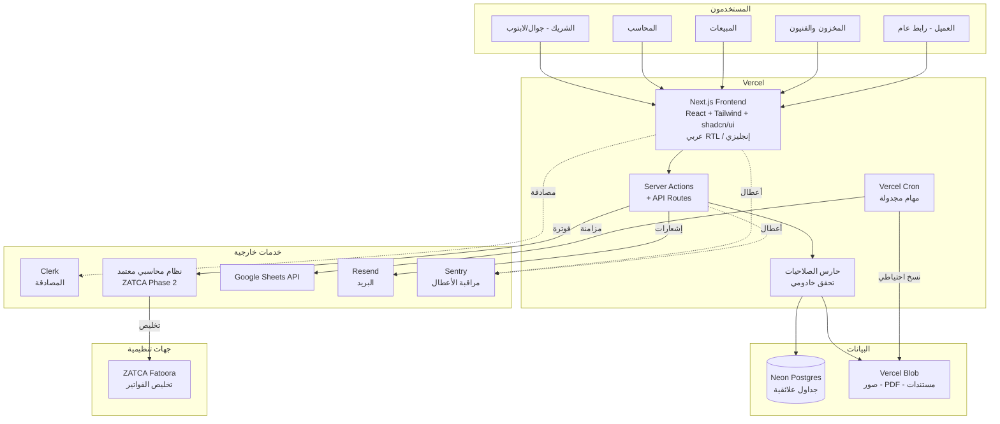

# وثيقة معمارية وخطة تنفيذ شاملة
## نظام إدارة الأعمال والمبيعات — شركة اندستريال تكنولوجيز (الرياض)

| | |
|---|---|
| **الإصدار** | 1.0 |
| **التاريخ** | 24 يوليو 2026 |
| **النطاق** | إعادة بناء كاملة لنظام mini_erp — من نموذج تجريبي إلى نظام تشغيلي معتمَد |
| **القطاع** | بيع معدات ورش السيارات وأفران الدهان الصناعية (B2B) |
| **الحالة** | مسودة للمراجعة — لم يبدأ التنفيذ بعد |

---

# ⚠️ 0. تنبيه عاجل يسبق كل شيء — امتثال ZATCA

**هذه أهم فقرة في الوثيقة. اقرأها قبل أي قرار تقني.**

أثناء إعداد هذه الوثيقة تحققتُ من الوضع التنظيمي الحالي لهيئة الزكاة والضريبة والجمارك، والنتيجة عاجلة:

- **الموجة 24** من المرحلة الثانية للفوترة الإلكترونية استهدفت كل منشأة تجاوزت إيراداتها الخاضعة للضريبة **375,000 ريال** في أي من أعوام 2022 أو 2023 أو 2024.
- **الموعد النهائي للامتثال كان 30 يونيو 2026** — أي **قبل نحو أربعة أسابيع من تاريخ هذه الوثيقة**.
- لم تُعلن الهيئة أي موجة جديدة بعد الموجة 24، ما يعني عملياً أن **المرحلة الثانية صارت سارية على كل منشأة مسجّلة في ضريبة القيمة المضافة**.

### ماذا يعني هذا لك تحديداً

أنت تبيع أفران دهان ومعدات ورش تتراوح أسعارها في نظامك التجريبي بين 9,800 و95,000 ريال للوحدة. **بيع خمس وحدات فقط يتجاوز حد الـ375,000 ريال.** الاحتمال الغالب جداً أنك داخل النطاق وأن الموعد قد مضى.

### الأثر المعماري المباشر

هذا يقلب ترتيب الأولويات رأساً على عقب:

1. **لا يجوز إطلاقاً** أن ننتظر ستة أشهر من البناء المرحلي قبل أن تصبح فوترتك متوافقة.
2. **لا يجوز** بناء طبقة الفوترة الضريبية والختم التشفيري من الصفر داخل نظامك المخصص — هذا مسار يستغرق شهوراً ويحمل مخاطرة تنظيمية لا مبرر لتحمّلها.
3. **التوصية القاطعة**: افصل «الفوترة الضريبية المعتمدة» عن «نظام إدارة الأعمال المخصص». اشترِ الأولى جاهزة ومعتمدة الآن، وابنِ الثانية على مهل — واربطهما. التفاصيل الكاملة في **القسم 6**.

### إجراء فوري مقترح (خارج نطاق البرمجة)

قبل أي سطر كود: راجع محاسبك القانوني هذا الأسبوع لتحديد (أ) هل أنت داخل النطاق فعلاً، (ب) ما وضعك الحالي، (ج) هل توجد غرامات مترتبة. لا تعتمد على هذه الوثيقة كمرجع قانوني — هي مرجع تقني معماري.

---

# 1. تحليل النظام السابق واستخراج أسلوبه

هذا القسم مبني على **قراءة كاملة للكود الفعلي** (4,326 سطراً في `public/index.html` + خمسة ملفات API + ملفات إعداد Firebase)، وليس على انطباع عام.

## 1.1 نقاط القوة — يجب الحفاظ عليها بالكامل

النظام السابق فشل تقنياً، لكنه نجح في شيء ثمين جداً: **تجسيد معرفة تشغيلية حقيقية عن شركتك**. هذه المعرفة هي الأصل الأثمن ولا يجوز أن تضيع في إعادة البناء.

| # | نقطة القوة | أين هي في الكود | لماذا تُحفَظ |
|---|---|---|---|
| 1 | **بوابات إنفاذ تنظيمية** — توقيع الشريكين إلزامي فوق عتبة مالية، ولا تسليم دون سداد 100% | `jointNeeded()`، `renderDOs()` | هذه ضوابط حوكمة حقيقية تحمي مالك — نادراً ما توجد في أنظمة جاهزة |
| 2 | **مصفوفة RACI** موثّقة لكل عملية + سجل انتقال الصلاحيات | `RACI_SEED`، `renderRaci()` | توزيع مسؤوليات مكتوب بين الشريكين — أصل تنظيمي وليس تقنياً |
| 3 | **حساب التكلفة الفعلية (Landed Cost)** من أمر الشراء + الشحن + الجمارك | `landedCost()` | جوهري لتجارة الاستيراد — يمنع تسعيراً خاسراً |
| 4 | **قيم تشغيل قابلة للتعديل بلا كود** (عتبات، مهل، أهداف) | `OPS_DEFAULTS` (23 قيمة) | يجعل النظام يتكيف مع نمو الشركة دون برمجة |
| 5 | **ترقيم مستندات احترافي** بنمط `PUR-2026-0001` | `nextNo()` | مطلب محاسبي وتنظيمي (تسلسل غير منقطع) |
| 6 | **ثنائية اللغة عربي/إنجليزي** في كل شاشة ومستند | كامل الملف | ضرورة للتعامل مع موردي الصين وتركيا + العملاء المحليين |
| 7 | **تتبّع الضمان** لكل رقم تسلسلي مع تاريخ بداية ونهاية | `warrantyStatus()` | مباشرةً في صميم عملك (معدات صناعية بضمان) |
| 8 | **تصنيف الموردين تلقائياً** (معتمد / بشروط / موقوف) | `supClass()` | ضبط جودة سلسلة التوريد |
| 9 | **إشعارات محسوبة من البيانات** لا مُدخلة يدوياً | `computeNotifs()` | النظام ينبّهك بدل أن تبحث أنت |
| 10 | **قوالب مستندات مطبوعة بهوية الشركة** موحّدة | `buildDoc()`، CSS الطباعة | مظهر احترافي أمام العميل |

## 1.2 نقاط الضعف والفجوات

| # | الضعف | التفصيل التقني | الخطورة |
|---|---|---|---|
| 1 | **الصلاحيات وهمية** | `canView/isAdmin` تعمل في المتصفح فقط. نقطة `/api/state` **بلا أي مصادقة** — أي شخص يعرف الرابط يقرأ أو يكتب فوق كامل بيانات الشركة | 🔴 حرجة |
| 2 | **انهيار تبعية خارجية** | مشروع Firebase توقف كلياً (`CONSUMER_INVALID`)، فتعطّل تسجيل الدخول ثم الصور وسجل التدقيق والنماذج العامة | 🔴 حرجة |
| 3 | **كل البيانات في صف واحد** | كامل حالة الشركة (29 كياناً) نص JSON في خانة واحدة `app_state.value` | 🔴 حرجة |
| 4 | **لا نسخ احتياطي** | لا جدولة، لا تصدير دوري، لا اختبار استعادة | 🔴 حرجة |
| 5 | **لا امتثال ضريبي** | الضريبة 15% تُحسب حسابياً فقط. لا فاتورة إلكترونية، لا UUID، لا ختم تشفيري، لا ربط بـFatoora | 🔴 حرجة |
| 6 | **لا مراقبة أعطال** | انهيار Firebase مرّ بصمت أسابيع حتى اكتُشف بالصدفة | 🟠 عالية |
| 7 | **لا اختبارات** | أي تعديل قد يكسر حساب فاتورة دون أن يلاحظ أحد | 🟠 عالية |
| 8 | **تعارض الكتابة** | جهازان يحفظان معاً ⇒ آخر حفظ يمحو الأول كلياً (Last-Write-Wins على كامل الحالة) | 🟠 عالية |
| 9 | **لا سجل تغييرات على مستوى الحقل** | سجل التدقيق كان على Firestore المعطّل، ولا يوثّق «ما القيمة قبل وبعد» | 🟠 عالية |
| 10 | **ملف واحد 4,326 سطراً** | البنية والتنسيق والمنطق مختلطة — صيانة صعبة وبطيئة | 🟡 متوسطة |
| 11 | **لا PDF حقيقي** | طباعة متصفح فقط — لا مرفق بريد إلكتروني للعميل | 🟡 متوسطة |
| 12 | **كود ميت** | `sync-data.js`، `create-tables.js`، استيرادات Firebase Auth — جميعها بلا استدعاء | 🟡 متوسطة |

## 1.3 كيف كانت تُحفَظ البيانات فعلياً (تشريح دقيق)

### أ) البيانات الهيكلية

```
Neon Postgres
└── app_state                    ← جدول واحد
    ├── id      = 'erp:state'    ← صف واحد فقط لكل النظام
    ├── value   = "{...}"        ← نص JSON يحوي 29 كياناً كاملاً
    └── updated_at
```

بداخل نص الـJSON، البنية كانت:

```
S = {
  counters:{}, notifRead:{}, categories:[], company:{}, ops:{}, coa:[], raci:[],
  products:[], customers:[], suppliers:[], employees:[],
  quotes:[], lines:[], sos:[], dos:[], prs:[], pos:[], stock:[], qc:[],
  srv:[], evals:[], complaints:[], shipments:[], petty:[], custody:[],
  expenses:[], users:[], installjobs:[], payroll:[],
  leads:[], contacts:[], opps:[], activities:[], campaigns:[], tickets:[],
  payments:[], coa:[]
}
```

**المشكلة الجوهرية**: لا جداول، لا علاقات، لا قيود. الربط بين عرض سعر وعميل كان **بمطابقة الاسم النصي** (`q.customer === c.name`) — أي أن تعديل اسم عميل واحد يقطع صلته بكل تاريخه.

### ب) الملفات والصور

```
Firebase Firestore (معطّل حالياً)
├── media/{imageId}      ← الصورة كنص Base64 داخل مستند (حد 900KB)
├── auditLogs/{logId}    ← سجل التدقيق
├── publicShares/{token} ← روابط موافقة العميل
├── publicIntake/{id}    ← نموذج الشكاوى العام + مرفقاته
└── publicProfile/main   ← اسم وشعار الشركة
```

**المشكلة**: تخزين الصور كنص Base64 داخل قاعدة بيانات أسلوب مكلف وبطيء ومحدود — الصور تنتمي لتخزين كائنات (Object Storage) لا لقاعدة بيانات.

### ج) نمط التسمية المستخدَم (يستحق الحفاظ عليه)

| النمط | المثال | الاستخدام |
|---|---|---|
| `{كود}-{سنة}-{تسلسل}` | `PUR-2026-0001` | كل المستندات |
| `PUB-{8 خانات}` | `PUB-A3F9C2D1` | الطلبات العامة |
| أكواد قياسية داخلية | `SLS-001`، `QLT-002`، `FIN-001` | ربط المستند بالإجراء التنظيمي |

## 1.4 مخطط المقارنة: قبل / بعد

| المحور | ❌ النظام القديم | ✅ النظام الجديد المقترح |
|---|---|---|
| **البنية** | ملف HTML واحد 4,326 سطراً | مشروع Next.js منظّم بوحدات ومكوّنات |
| **اللغة** | JavaScript خام بلا أنواع | TypeScript — الأخطاء تُكتشف قبل النشر |
| **قاعدة البيانات** | صف واحد يحوي JSON كامل | جداول علائقية بقيود ومفاتيح أجنبية |
| **الربط بين السجلات** | مطابقة نصية بالاسم | مفاتيح أجنبية (Foreign Keys) تفرضها القاعدة |
| **الحفظ** | استبدال كامل الحالة عند كل تعديل | تعديل السجل المعني فقط داخل معاملة ذرية |
| **التزامن** | آخر حفظ يمحو ما قبله | معاملات ACID — لا فقدان بيانات |
| **المصادقة** | Firebase منهار ← ثم تنفيذ ذاتي | Clerk — خدمة متخصصة معتمدة |
| **الصلاحيات** | إخفاء أزرار في المتصفح فقط | تحقق خادومي في كل عملية |
| **حماية API** | `/api/state` مفتوحة للجميع | كل نقطة محمية بجلسة + دور |
| **الملفات** | Base64 داخل Firestore | Vercel Blob — تخزين كائنات حقيقي |
| **الفوترة الضريبية** | لا شيء (حساب 15% فقط) | نظام معتمد ZATCA متكامل عبر API |
| **PDF** | طباعة متصفح | توليد PDF فعلي قابل للإرسال بالبريد |
| **النسخ الاحتياطي** | لا يوجد | يومي تلقائي + اختبار استعادة شهري |
| **مراقبة الأعطال** | لا يوجد | Sentry — تنبيه خلال دقائق |
| **سجل التدقيق** | على خدمة معطّلة | جدول مستقل يوثّق القيمة قبل/بعد |
| **الاختبارات** | لا يوجد | اختبارات على المسارات المالية الحرجة |
| **Google Sheets** | لا يوجد | مزامنة تلقائية مجدولة |
| **معرفة العمل** | ✅ ممتازة (RACI، عتبات، Landed Cost) | ✅ **تُنقَل كما هي وتُعزَّز بإنفاذ خادومي** |

---

# 2. الحزمة التقنية (Tech Stack)

> **ملاحظة عن الأسعار**: بالريال السعودي، بسعر تحويل ~3.75 ريال/دولار. الأسعار **تقريبية وقابلة للتغيير** من المزوّدين — تحقق منها عند الشراء. معظم المكوّنات لها طبقة مجانية تكفي بدايتك فعلياً.

## 2.1 الواجهة الأمامية (Frontend)

| البند | التفصيل |
|---|---|
| **الاختيار** | Next.js 15+ (App Router) + TypeScript + Tailwind CSS + shadcn/ui |
| **سبب الاختيار** | Vercel هي مطوّرة Next.js — أعمق توافق ممكن مع استضافتك الحالية: نشر تلقائي، ورابط معاينة منفصل لكل تعديل قبل أن يلمس النظام الحي. shadcn/ui تعطيك مكوّنات احترافية جاهزة (جداول، نماذج، حوارات) داخل مشروعك مباشرة — لا تصميم من الصفر كما استهلك جهدك سابقاً |
| **دعم RTL** | Tailwind يدعم الاتجاه المنطقي أصلاً (`ms-`/`me-` بدل `left`/`right`)، وNext.js يدعم التوجيه حسب اللغة (`/ar`, `/en`). الخطوط: Cairo + Tajawal (مستخدمة فعلاً في نظامك الحالي — نُبقيها للاستمرارية البصرية) |
| **البديل الأرخص** | نفس الحزمة — هي أصلاً مجانية مفتوحة المصدر. التوفير الوحيد بالبقاء على خطة Vercel Hobby (مجانية) بدل Pro |
| **البديل الأقوى** | إضافة Framer Motion للحركات + Storybook لتوثيق المكوّنات — قيمة محدودة لفريق بحجمك |
| **التكلفة** | **0 ريال** (المكتبات مجانية — تكلفة الاستضافة في 2.2) |

## 2.2 الخلفية وقاعدة البيانات (Backend & Database)

| البند | التفصيل |
|---|---|
| **الاختيار** | Next.js Server Actions / Route Handlers (لا خادوم منفصل) + **Neon Postgres** + **Prisma ORM** |
| **سبب الاختيار — لماذا علائقية** | بيانات ERP مترابطة بصرامة: عميل ← عرض سعر ← أمر بيع ← دفعة ← حركة مخزون. القيود يجب أن **تفرضها القاعدة** لا أن يتذكّرها الكود. المحاسبة تحتاج معاملات ذرية: تسجيل دفعة + تحديث الذمم + سجل تدقيق ⇒ إما الثلاثة معاً أو لا شيء |
| **سبب اختيار Neon تحديداً** | تكامل Marketplace أصلي مع Vercel، و**ميزة التفرّع (Branching)**: تنسخ قاعدة البيانات كاملة لاختبار أي تعديل هيكلي دون خطر على بياناتك الحية — شبكة أمان لا تُقدَّر بثمن لمن يعمل بلا فريق مراجعة |
| **لماذا ORM ضروري** | بلا طبقة أنواع، أي خطأ في اسم عمود يظهر وقت التشغيل عند العميل لا وقت الكتابة. Prisma يوفّر هجرات منظّمة + `Prisma Studio` لتصفّح بياناتك بصرياً بنفسك دون SQL |
| **البديل الأرخص** | Supabase (طبقة مجانية سخية تشمل القاعدة + المصادقة + التخزين في اشتراك واحد) — يوفّر عليك اشتراكَي Clerk وBlob |
| **البديل الأقوى** | PlanetScale أو AWS RDS مع نسخ احتياطي متعدد المناطق — مبالغة كاملة لحجمك حالياً |
| **التكلفة** | Vercel Pro **~75 ريال/شهر** (يمكن البدء بالمجانية) · Neon: مجاني للبداية، خطة Launch **~71 ريال/شهر** عند النمو |

## 2.3 التخزين والنسخ الاحتياطي

### أ) الملفات (صور المنتجات، PDF، المرفقات)

| البند | التفصيل |
|---|---|
| **الاختيار** | **Vercel Blob** |
| **سبب الاختيار** | منتج أول-طرف من Vercel: لا حساب خارجي، لا فوترة منفصلة، ربط مباشر بمشروعك. يحل بالضبط عطل «الصور المعطّلة» الموروث من Firebase. يدعم ملفات عامة (صور منتجات) وخاصة (فواتير، مستندات جمركية) |
| **التنظيم المقترح** | `products/{productId}/{uuid}.webp` · `quotes/{quoteNo}.pdf` · `invoices/{invoiceNo}.pdf` · `shipments/{shipmentNo}/{docType}.pdf` |
| **البديل الأرخص** | Cloudflare R2 (بلا رسوم إخراج بيانات) — أرخص عند الحجم الكبير، لكنه حساب ومنصة إضافية |
| **البديل الأقوى** | Cloudinary — تحويل وضغط صور تلقائي متقدم. مفيد لو صرت تعرض كتالوج منتجات ضخماً للعملاء |
| **التكلفة** | حسب الاستهلاك — **~20–40 ريال/شهر** متوقعة لحجمك |

### ب) النسخ الاحتياطي — إلزامي وليس اختيارياً

استراتيجية **3 طبقات** (لا تعتمد على طبقة واحدة أبداً):

| الطبقة | الآلية | التردد | مكان الحفظ |
|---|---|---|---|
| 1. تلقائي من المزوّد | استعادة لنقطة زمنية (PITR) من Neon | مستمر | Neon (تحقق من مدة الاستبقاء في خطتك) |
| 2. تصدير مستقل | Vercel Cron ينفّذ `pg_dump` مضغوطاً | يومي 3 صباحاً | Vercel Blob (خاص) — **خارج Neon** |
| 3. نسخة باردة | تحميل يدوي شهري لجهازك/قرص خارجي | شهري | خارج السحابة تماماً |

**اختبار الاستعادة**: مرة شهرياً، استعادة آخر نسخة على **فرع Neon مؤقت** (لا الحي)، والتحقق من تطابق عدد السجلات. **نسخة احتياطية لم تُختبر استعادتها ليست نسخة احتياطية.**

## 2.4 المصادقة والصلاحيات

| البند | التفصيل |
|---|---|
| **الاختيار** | **Clerk** لتسجيل الدخول + جدول أدوار خاص بك في Neon |
| **سبب الاختيار** | الدرس المباشر من انهيار نظامك السابق: **لا تُدِر مصادقة بنفسك لنظام تعتمد عليه بالكامل**. Clerk تكامل Marketplace أصلي مع Vercel، شاشات دخول احترافية جاهزة، تحقق بخطوتين، إدارة جلسات آمنة — كلها بلا كود منك |
| **الأدوار** | 5 أدوار: `OWNER` (شريك) · `ACCOUNTANT` (محاسب) · `SALES` (مبيعات) · `WAREHOUSE` (مخزون) · `TECHNICIAN` (فني تركيب) |
| **الفارق الجوهري عن السابق** | التحقق **خادومي في كل عملية** — لا مجرد إخفاء زر. تُطبَّق كـ«حارس» موحّد قبل تنفيذ أي إجراء |
| **البديل الأرخص** | Supabase Auth (مجاني ضمن Supabase) أو Auth.js — الأخير مجاني لكنك تتحمّل مسؤولية أمانه |
| **البديل الأقوى** | Auth0 / WorkOS — للربط مع أنظمة دخول مؤسسي (SSO). لا حاجة لك حالياً |
| **التكلفة** | مجاني حتى 10,000 مستخدم نشط شهرياً — **0 ريال لك عملياً**. الخطة المدفوعة ~94 ريال/شهر |

## 2.5 أدوات مساندة ضرورية من اليوم الأول

| الأداة | الغرض | لماذا الآن لا لاحقاً | التكلفة |
|---|---|---|---|
| **Sentry** | مراقبة الأعطال | بلا فريق يراقب، أي عطل يمر بصمت — كما حدث فعلاً مع Firebase | مجاني للبداية · ~98 ريال/شهر لاحقاً |
| **Resend** | إشعارات بريدية | عرض سعر للعميل، تنبيه مخزون، تذكير سداد — يحوّل النظام من أداة تنتظر فتحها إلى نظام يعمل عنك | مجاني حتى 3,000 رسالة/شهر |
| **@react-pdf/renderer** | توليد PDF فعلي | عروض الأسعار للعملاء الصناعيين تُرسَل كمرفق، لا كطباعة شاشة | مجاني |
| **Vitest + Playwright** | اختبارات | تغطية المسارات المالية فقط (دفعة، تسليم، مخزون) — بديلك عن فريق مراجعة | مجاني |

## 2.6 ملخص التكلفة الشهرية

| المرحلة | المكوّنات | التكلفة الشهرية |
|---|---|---|
| **البداية** (طبقات مجانية) | Vercel Hobby + Neon Free + Clerk Free + Sentry Free + Resend Free | **~0–60 ريال** |
| **التشغيل الفعلي** (موصى به) | Vercel Pro + Neon Launch + Blob + نظام محاسبي معتمد | **~230–350 ريال** |
| **النمو** (فريق أكبر) | كل ما سبق بخطط مدفوعة كاملة | **~450–600 ريال** |

> للمقارنة: نظام ERP جاهز لشركة بحجمك يكلف عادة 1,500–5,000 ريال شهرياً، ولا يمنحك بوابات الإنفاذ ومصفوفة RACI المخصصة لشركتك.

---

# 3. الربط المباشر مع Google Sheets

## 3.1 قرار معماري أولاً: لماذا اتجاه واحد

**التوصية: مزامنة أحادية الاتجاه (النظام ← Sheets) وليست ثنائية.**

| | مزامنة أحادية ✅ | مزامنة ثنائية ❌ |
|---|---|---|
| مصدر الحقيقة | واضح: قاعدة البيانات | غامض: أيهما يفوز عند التعارض؟ |
| خطر فساد البيانات | معدوم | عالٍ — صيغة خاطئة في خلية تفسد سجلاً محاسبياً |
| القيود | محفوظة في القاعدة | يمكن تجاوزها بالكتابة المباشرة في الشيت |
| التعقيد | بسيط | يحتاج منطق حل تعارضات كامل |

الشيت يصبح **نافذة عرض ومشاركة وتحليل**، لا مصدر إدخال. لو احتجت إدخالاً جماعياً من الشيت لاحقاً، نبنيه كـ«استيراد صريح» بزر ومراجعة، لا كمزامنة صامتة.

## 3.2 خطوات التنفيذ التفصيلية

### الخطوة 1 — إنشاء مشروع Google Cloud
1. ادخل [console.cloud.google.com](https://console.cloud.google.com) بحساب Google الخاص بالشركة (لا حساب شخصي).
2. أنشئ مشروعاً جديداً باسم `industrial-tech-erp`.
3. من **APIs & Services → Library**: فعّل **Google Sheets API** و**Google Drive API**.

### الخطوة 2 — إنشاء حساب خدمة (Service Account)
1. **APIs & Services → Credentials → Create Credentials → Service Account**.
2. الاسم: `erp-sheets-writer`.
3. بعد الإنشاء: **Keys → Add Key → Create new key → JSON** — يُنزَّل ملف مفاتيح.
4. ⚠️ **هذا الملف سر مطلق** — لا يُرفع لـGit إطلاقاً.

### الخطوة 3 — حفظ المفاتيح في Vercel
احفظ في **Environment Variables** على Vercel:
- `GOOGLE_SERVICE_ACCOUNT_EMAIL` — البريد من ملف JSON (ينتهي بـ`.iam.gserviceaccount.com`)
- `GOOGLE_PRIVATE_KEY` — المفتاح الخاص من الملف
- `GOOGLE_SHEET_ID` — معرّف الشيت من رابطه

### الخطوة 4 — إنشاء الشيت ومنح الصلاحية
1. أنشئ ملف Google Sheets باسم `ITCO — ERP Live Data`.
2. اضغط **مشاركة**، وألصق بريد حساب الخدمة، وامنحه صلاحية **محرِّر**.
3. أنشئ التبويبات: `المنتجات` · `العملاء` · `عروض الأسعار` · `أوامر البيع` · `المخزون` · `الدفعات` · `الشحنات`.

### الخطوة 5 — البناء البرمجي
- المكتبة: `googleapis` الرسمية.
- نمط الكتابة: **مسح التبويب ثم كتابته كاملاً** (`clear` ثم `values.update`) — أبسط وأضمن من محاولة تحديث صفوف مفردة.
- الصف الأول دائماً عناوين أعمدة مجمّدة.
- عمود أخير `آخر تحديث` بختم زمني لتعرف حداثة البيانات بنظرة.

### الخطوة 6 — الجدولة عبر Vercel Cron
يُعرَّف في `vercel.json` مسار مجدول يستدعي نقطة نهاية محمية بمفتاح سري، فتقرأ من Neon وتكتب في Sheets.

## 3.3 التردد المقترح لكل مجموعة

| البيانات | التردد | السبب |
|---|---|---|
| **المخزون** | كل ساعة | يتغير كثيراً وقرارات الشراء تعتمد عليه |
| **المبيعات (عروض/أوامر)** | كل 4 ساعات | متابعة كافية دون إرهاق |
| **العملاء** | يومياً | نادر التغيير |
| **الدفعات والذمم** | يومياً 6 صباحاً | يكفي لمراجعة المحاسب الصباحية |
| **الشحنات والمستوردات** | يومياً | دورتها بالأسابيع لا الساعات |
| **لقطة KPI** | يومياً منتصف الليل | تُضاف كصف جديد لبناء تاريخ اتجاهات |

> **حدود تقنية**: Google Sheets API له حد ~60 طلباً/دقيقة لكل مستخدم، و10 ملايين خلية للملف. التردد أعلاه بعيد جداً عن الحدود.

## 3.4 مخاطر يجب الانتباه لها

| الخطر | التخفيف |
|---|---|
| تسرّب مفتاح حساب الخدمة | لا يُرفع لـGit أبداً · تدوير المفتاح سنوياً |
| بيانات حساسة (رواتب، تكاليف) في شيت مشترك | تبويبات الرواتب والتكاليف في **ملف منفصل** بصلاحيات أضيق |
| شخص يعدّل الشيت ظاناً أنه يعدّل النظام | تبويب أول بعنوان صريح: «للعرض فقط — التعديل يُمحى عند المزامنة» |
| فشل مزامنة صامت | تنبيه Sentry + بريد عند فشل مهمة Cron |

---

# 4. متطلبات واجهة المستخدم

## 4.1 المبادئ

| المبدأ | التطبيق العملي |
|---|---|
| **بسيط وحديث** | مساحة بيضاء واسعة، ألوان هوية ITCO الحالية (كحلي `#0E2342` + أحمر `#DA291C`)، بلا زخرفة |
| **خفيف وسريع** | استهداف تحميل أول أقل من ثانيتين على 3G · Server Components تقلّل JavaScript المرسل · صور WebP مُحسّنة |
| **متجاوب فعلاً** | تصميم يبدأ من الجوال (Mobile-First) — البائع في السوق يستخدم جواله، والمحاسب يستخدم اللابتوب |
| **RTL كامل** | العربية افتراضية · تبديل فوري للإنجليزية · الأرقام دائماً LTR |

## 4.2 نظام «ماذا الآن؟ وما التالي؟»

هذا مطلبك الصريح، ويُنفَّذ بأربع طبقات:

| الطبقة | الوصف | مثال |
|---|---|---|
| 1. **شريط سياق أعلى كل شاشة** | جملة واحدة: ما هذه الشاشة + الخطوة التالية | «عروض الأسعار: أنشئ عرضاً واعتمده. **التالي**: عند قبول العميل ← حوّله لأمر بيع» |
| 2. **مؤشر تقدّم للمستندات** | شريط مراحل يبيّن موقعك في الدورة | `عرض سعر ← ✅ أمر بيع ← 🔵 دفعة مقدمة ← ⚪ تسليم` |
| 3. **تلميحات (Tooltips)** | أيقونة `؟` بجانب كل حقل غامض | بجانب «التكلفة الفعلية»: «تُحسب تلقائياً من آخر شراء + الشحن + الجمارك» |
| 4. **إرشاد أولي (Onboarding)** | جولة 5 خطوات لكل دور عند أول دخول | المحاسب يُرشَد لشاشة الذمم، البائع لعروض الأسعار |

> النظام السابق كان فيه `HELP_MAP` بهذا المعنى تماماً (ماذا/من/التالي لكل شاشة) — **نُبقي المحتوى ونحسّن العرض**.

## 4.3 لوحة «ابدأ يومك» لكل دور

بدل لوحة تحكم واحدة عامة، كل دور يرى عند الدخول ما يخصه:

- **الشريك**: نقد متاح · صفقات تحتاج توقيعك · تنبيهات حمراء
- **المحاسب**: دفعات لتسجيلها · ذمم متأخرة · موعد الإقرار الضريبي
- **المبيعات**: عروض تحتاج متابعة · صفقات راكدة · مهام اليوم
- **المخزون**: منتجات تحت الحد الأدنى · شحنات واردة · طلبات تجهيز

---

# 5. لوحة القرارات والتقارير (Business Intelligence)

## 5.1 المعمارية

المرحلة الأولى: **حساب مباشر من Postgres** (استعلامات مُفهرَسة) — لا حاجة لمستودع بيانات منفصل بحجمك. عند تجاوز ~100 ألف سجل، ننتقل لجداول تجميع ليلية.

## 5.2 تقرير أداء المبيعات

| البُعد | المؤشرات |
|---|---|
| **حسب المنتج** | الإيراد · الكمية · هامش الربح (بعد Landed Cost) · معدل التحويل من عرض لأمر |
| **حسب العميل** | إجمالي المشتريات · متوسط قيمة الصفقة · تاريخ آخر شراء · الذمم القائمة |
| **حسب المنطقة** | الرياض / جدة / الدمام / أخرى — كثافة المبيعات جغرافياً |
| **حسب الفترة** | شهري وربعي وسنوي · مقارنة بالفترة المماثلة السابقة |
| **قمع المبيعات** | محتمل ← عرض ← أمر ← تسليم، مع نسبة التسرّب في كل مرحلة |

## 5.3 تقرير المخزون

| المؤشر | طريقة الحساب | القرار الذي يدعمه |
|---|---|---|
| الكمية الحالية | وارد − صادر | هل أستطيع البيع الآن؟ |
| **معدل الدوران** | تكلفة المبيعات ÷ متوسط المخزون | أي منتج يحرّك رأس مالي فعلاً |
| **نقطة إعادة الطلب** | (متوسط الاستهلاك اليومي × مدة التوريد) + مخزون أمان | **متى أطلب من الصين/تركيا** — حرج لأن التوريد بالأسابيع |
| **المنتجات الراكدة** | بلا حركة > 180 يوماً | رأس مال مجمّد يحتاج تصريفاً |
| قيمة المخزون | الكمية × التكلفة الفعلية | أصل في الميزانية |

## 5.4 تقرير المستوردات (خاص بطبيعة عملك)

| المؤشر | الوصف |
|---|---|
| **زمن التوريد الفعلي** | من أمر الشراء حتى الاستلام — **لكل مورد على حدة** (الصين ≠ تركيا) |
| **تفكيك التكلفة** | قيمة البضاعة · الشحن · الجمارك · التخليص · النقل الداخلي ⇒ **التكلفة النهائية للوحدة** |
| **دقة المورد** | الفارق بين الموعد الموعود والفعلي — يغذّي تصنيف المورد |
| **أثر سعر الصرف** | تتبّع الدولار/اليوان/الليرة على تكلفة الشحنة |
| **الشحنات الجارية** | لوحة حية: قيد الإنتاج · شُحنت · في الميناء · تخليص · وصلت |

## 5.5 مؤشرات الأداء (KPIs) مع الاتجاه

كل مؤشر يُعرض بـ: **القيمة الحالية · الهدف · اتجاه (▲▼) مقابل الفترة السابقة · رسم اتجاه صغير**

| الفئة | المؤشرات |
|---|---|
| مالية | الإيراد · الهامش الإجمالي % · النقد المتاح · متوسط أيام التحصيل |
| مبيعات | صفقات مغلقة · معدل التحويل · متوسط قيمة الصفقة |
| تشغيل | زمن التوريد · التسليم في الموعد % · دقة الجرد % |
| خدمة | زمن الاستجابة الأولى · إقفال الشكاوى ضمن المهلة % |

**التقنية**: Recharts (خفيفة، تعمل مع React مباشرة). الرسوم تحترم RTL وتدعم التصدير كصورة أو CSV.

---

# 6. التقرير الضريبي والمحاسبي — التوافق مع ZATCA

> راجع **القسم 0** أولاً: الموعد النهائي للموجة 24 كان **30 يونيو 2026** وقد مضى.

## 6.1 القرار المعماري الأهم في هذه الوثيقة: اشترِ ولا تبنِ

**لا تبنِ طبقة الفوترة الإلكترونية المعتمدة داخل نظامك المخصص.** هذا رأيي الصريح كمعماري، ولهذه الأسباب:

| السبب | التفصيل |
|---|---|
| **تعقيد تقني حقيقي** | المرحلة الثانية تتطلب: XML بصيغة UBL 2.1 · ختم تشفيري · شهادة CSID من الهيئة · تسلسل تجزئة (PIH) يربط كل فاتورة بسابقتها · تخليص (Clearance) لحظي عبر API قبل تسليم الفاتورة للعميل |
| **الوقت لا يسمح** | الموعد مضى. بناء هذا من الصفر واختباره يستغرق أشهراً |
| **مخاطرة تنظيمية** | خطأ في التنفيذ = فواتير مرفوضة = غرامات وتوقف مبيعات |
| **صيانة مستمرة** | الهيئة تحدّث المواصفات دورياً — ستلاحقها إلى الأبد |
| **B2B = تخليص لحظي** | عملاؤك منشآت، فالفاتورة **قياسية** تتطلب تخليصاً من الهيئة **قبل** تسليمها للعميل — لا مجال للتأجيل |

## 6.2 المعمارية المقترحة: فصل الطبقتين

```
نظامك المخصص (تبنيه)          نظام محاسبي معتمد (تشتريه)
─────────────────────          ──────────────────────────
عروض الأسعار                    الفاتورة الضريبية الرسمية
دورة الموافقات والتوقيع  ──API──▶  الختم التشفيري + UUID + QR
المخزون والمستوردات              التخليص عبر Fatoora
CRM والصيانة والضمان             الإقرار الضريبي الربعي
Landed Cost وRACI               دفتر الأستاذ والقيود
```

**كيف يعمل عملياً**: عند تحويل أمر بيع إلى فاتورة، نظامك يرسل البيانات عبر API للنظام المعتمد، فيُصدر الفاتورة المتوافقة ويعيد لك رقمها ورمز QR ورابط PDF — تحفظها مرجعياً وتعرضها للعميل.

## 6.3 مقارنة الأنظمة المعتمدة

| النظام | الميزة الأبرز | السعر التقريبي | ملاحظة |
|---|---|---|---|
| **Zoho Books (نسخة السعودية)** | الأرخص دخولاً · API ناضج جداً | **~60 ريال/شهر** (3 مستخدمين) | خيار ممتاز للربط البرمجي |
| **Wafeq** | أفضل تجربة ثنائية اللغة · سعودي | متوسط | واجهة مريحة لمحاسبك |
| **Qoyod** | سعودي (الرياض) · قريب من الأعراف المحاسبية المحلية | متوسط | قوي للخدمات والمشاريع |

**توصيتي**: ابدأ بـ**Zoho Books KSA** — أقل تكلفة وأنضج واجهة برمجية للربط، وهو ما تحتاجه تحديداً بما أن نظامك سيتحدث معه آلياً.

> ⚠️ تحقق بنفسك من ورود أي نظام في **الدليل الرسمي المعتمد** لدى الهيئة قبل الشراء — القوائم تتغير.

## 6.4 ما يبقى في نظامك أنت

| العنصر | التفصيل |
|---|---|
| **شجرة الحسابات** | نظامك الحالي فيه `COA_SEED` بالفعل — تُنقَل وتُربَط بشجرة النظام المحاسبي. الريال السعودي عملة أساسية، ودعم عملات الموردين (USD/CNY/TRY) للمستوردات |
| **تقرير ضريبة القيمة المضافة** | لوحة ربعية تعرض: ضريبة المخرجات (المبيعات 15%) · ضريبة المدخلات (المشتريات والمستوردات) · الصافي المستحق — **للمراجعة والتخطيط**، بينما الإقرار الرسمي يُقدَّم من النظام المعتمد |
| **الأرشفة الإلكترونية** | حفظ كل فاتورة (XML + PDF + رمز QR) في Vercel Blob بتنظيم `invoices/{سنة}/{رقم}/`، مع سجل تدقيق غير قابل للتعديل. **مدة الاحتفاظ النظامية يحدّدها محاسبك — تحقق منها ولا تعتمد على تقدير** |
| **الربط المرجعي** | كل فاتورة في نظامك تحمل معرّف الفاتورة في النظام المعتمد — تتبّع كامل من عرض السعر حتى الإقرار |

---

# 7. إدارة علاقات العملاء (CRM) وما بعد البيع

## 7.1 دورة حياة الطلب

```
عميل محتمل ← عرض سعر ← موافقة العميل ← أمر بيع ← دفعة مقدمة
   ← تجهيز/استيراد ← جاهز للشحن ← مشحون ← تسليم وتركيب ← مكتمل
```

كل انتقال يسجّل: **من · متى · ملاحظة**، ويُشعِر المعنيين تلقائياً. العميل يتابع حالة طلبه عبر **رابط عام آمن** (تطوير لفكرة `publicShares` الموجودة أصلاً في نظامك).

## 7.2 طلبات الصيانة

| الأولوية | مهلة الاستجابة | التصعيد |
|---|---|---|
| 🔴 حرج (توقف إنتاج العميل) | 4 ساعات | فوري للشريك |
| 🟠 عالٍ (ضمان) | 24 ساعة | بعد 48 ساعة |
| 🟡 عادي | 3 أيام عمل | بعد 5 أيام |
| ⚪ منخفض | 7 أيام | — |

يشمل: ربط تلقائي بحالة الضمان عبر الرقم التسلسلي · تعيين فني · تذكيرات · تقييم العميل بعد الإغلاق · **صيانة وقائية مجدولة** (فرصة إيراد متكرر لمعدات صناعية).

## 7.3 عروض الأسعار

- تحويل بنقرة: **عرض سعر ← أمر بيع ← فاتورة** (بلا إعادة إدخال)
- إصدارات متعددة للعرض مع حفظ التاريخ (v1, v2, v3)
- صلاحية زمنية وتنبيه قبل انتهائها
- موافقة إلكترونية من العميل عبر رابط (موجودة في نظامك — تُحسَّن)
- PDF احترافي يُرسَل بالبريد مباشرة

---

# 8. صفحة المنتج

بنية كل منتج ترتبط بأربع مجموعات:

## 8.1 الصور
- صور متعددة (رئيسية + معرض + مخططات فنية)
- تحسين تلقائي: WebP، أحجام متعددة، تحميل كسول
- التخزين: `products/{id}/{uuid}.webp` في Vercel Blob

## 8.2 الشروط والأحكام
- شروط عامة للشركة + **شروط خاصة بالمنتج** (تركيب، تدريب، قطع غيار)
- إصدارات مؤرشفة: كل عرض سعر يحفظ **الشروط السارية وقت إصداره** — حماية قانونية مهمة

## 8.3 الضمان
- المدة بالأشهر · نقطة البدء (تسليم أم تركيب) · ما يشمله وما يستثنيه
- شروط الإبطال (سوء استخدام، صيانة غير معتمدة)
- ربط تلقائي بالرقم التسلسلي وبطلبات الصيانة

## 8.4 المواصفات التقنية
- حقول مرنة حسب الفئة (فرن دهان: الأبعاد، قوة المحرك، نوع الفلاتر، استهلاك الطاقة...)
- ثنائية اللغة لكل مواصفة
- ملف مواصفات PDF قابل للتحميل
- **جدول مقارنة بين المنتجات** — أداة بيع فعّالة للعميل الصناعي

---

# 9. المخطط المعماري



## تدفق فاتورة نموذجية

```
1. المبيعات ينشئ عرض سعر ──▶ Postgres
2. PDF يُولَّد ──▶ Blob ──▶ بريد للعميل (Resend)
3. العميل يوافق عبر رابط عام ──▶ تحديث الحالة
4. تحويل لأمر بيع (تحقق صلاحية خادومي)
5. تجاوز العتبة؟ ──▶ بوابة توقيع الشريكين
6. تسجيل الدفعة ──▶ معاملة ذرية (دفعة + ذمم + تدقيق)
7. سداد كامل؟ ──▶ فتح بوابة التسليم
8. إصدار الفاتورة ──▶ API النظام المعتمد ──▶ ZATCA ──▶ QR + UUID
9. الأرشفة ──▶ Blob · المزامنة ──▶ Google Sheets
```

---

# 10. الخارطة الزمنية التنفيذية (Roadmap)

> المدد تقديرية بافتراض عمل مركّز بمساعدتي. معيار الاكتمال **ليس** «الكود يعمل» بل اختبار محدد ينجح.

## 🔴 المرحلة 0 — الامتثال الضريبي العاجل (الأسبوع 1)
**تسبق كل شيء — لا تنتظر النظام الجديد.**

| المهمة | المخرج |
|---|---|
| مراجعة المحاسب: هل أنت داخل نطاق الموجة 24؟ | تحديد الوضع والغرامات المحتملة |
| اختيار وتفعيل نظام محاسبي معتمد | حساب فعّال ومربوط بالهيئة |
| إصدار فواتيرك الحالية عبره | امتثال فوري ولو يدوياً مؤقتاً |

**معيار الاكتمال**: إصدار فاتورة حقيقية متوافقة بنجاح ✅

---

## المرحلة 1 — التأسيس التقني (أسبوع 1–2)

| المهمة | التفصيل |
|---|---|
| مشروع Next.js + TypeScript + Tailwind + shadcn/ui | هيكل نظيف |
| ربط: Vercel · Neon · Clerk · Blob · Sentry | كل الخدمات متصلة |
| هيكل ثنائي اللغة RTL/LTR | التبديل يعمل |
| خط النشر (Git ← معاينة ← إنتاج) | نشر آمن |

**معيار الاكتمال**: صفحة تجريبية منشورة، تقرأ من القاعدة، وخطأ متعمّد يظهر في Sentry ✅

---

## المرحلة 2 — تصميم قاعدة البيانات (أسبوع 2–3)

كل الجداول والعلاقات والقيود: الشركة · المستخدمون والأدوار · العملاء · الموردون · المنتجات (بمواصفات وضمان) · عروض الأسعار وبنودها · أوامر البيع · إذون التسليم · طلبات وأوامر الشراء · الشحنات والمستوردات · حركات المخزون · الدفعات · المصروفات · شجرة الحسابات · سجل التدقيق · طلبات الصيانة.

**معيار الاكتمال**: محاولة إدخال بيانات مخالفة (دفعة على فاتورة غير موجودة، كمية سالبة) **تُرفَض من القاعدة نفسها** ✅

---

## المرحلة 3 — المصادقة والصلاحيات (أسبوع 3–4)

Clerk + الأدوار الخمسة + حارس خادومي موحّد + سجل تدقيق يعمل.

**معيار الاكتمال**: 5 حسابات تجريبية — محاولة وصول مباشر لرابط محظور تُرفَض **خادومياً**، والمحاولة تُسجَّل في التدقيق ✅

---

## المرحلة 4 — البيانات الأساسية (أسبوع 4–6)

المنتجات (صور + مواصفات + ضمان + شروط) · العملاء · الموردون · الموظفون · البحث والتصفية.

**معيار الاكتمال**: إدخال 10 منتجات حقيقية بصورها ومواصفاتها الكاملة ✅

---

## المرحلة 5 — دورة المبيعات (أسبوع 6–9) 🎯 *أهم مرحلة*

عروض الأسعار (إصدارات + PDF + بريد) · موافقة العميل برابط · التحويل لأمر بيع · بوابة توقيع الشريكين · الدفعات · بوابة «لا تسليم دون سداد» · إذن التسليم · **الربط بالنظام المحاسبي للفوترة**.

**معيار الاكتمال**: صفقة حقيقية كاملة من عرض سعر حتى فاتورة متوافقة، والبوابتان تمنعان التجاوز فعلياً ✅

> **من هنا يصبح النظام صالحاً للاستخدام اليومي الفعلي.**

---

## المرحلة 6 — المشتريات والمخزون والمستوردات (أسبوع 9–12)

طلبات وأوامر الشراء · الشحنات وتتبّعها · **حساب Landed Cost** · حركات المخزون · نقاط إعادة الطلب · تنبيهات بريدية · تقييم الموردين.

**معيار الاكتمال**: تسجيل شحنة استيراد كاملة، والتكلفة النهائية للوحدة تُحسب صحيحة ومطابقة لحسابك اليدوي ✅

---

## المرحلة 7 — المالية والتقارير (أسبوع 12–15)

الذمم المدينة · المصروفات والعهد · شجرة الحسابات · لوحة الضريبة الربعية · تقارير المبيعات والمخزون والمستوردات · KPIs بالرسوم.

**معيار الاكتمال**: تقرير ذمم يطابق كشف حسابك يدوياً · لوحة ضريبة تطابق النظام المحاسبي ✅

---

## المرحلة 8 — CRM والخدمة (أسبوع 15–17)

العملاء المحتملون · خط المبيعات · الأنشطة · طلبات الصيانة بالأولويات · الشكاوى · تتبّع الضمان · بوابة العميل.

**معيار الاكتمال**: طلب صيانة من عميل حقيقي يمر بالدورة كاملة حتى الإغلاق والتقييم ✅

---

## المرحلة 9 — التكاملات والتشغيل (أسبوع 17–19)

مزامنة Google Sheets · النسخ الاحتياطي الثلاثي **مع اختبار استعادة فعلي** · الإشعارات · مراجعة أمنية · نقل مصفوفة RACI والدليل.

**معيار الاكتمال**: استعادة نسخة احتياطية على فرع مؤقت تنجح وتطابق الأصل · الشيت يتحدث تلقائياً ✅

---

## المرحلة 10 — الإطلاق (أسبوع 19–20)

تدريب قصير للفريق · إدخال البيانات الحقيقية · تشغيل موازٍ أسبوعين · إيقاف النظام القديم.

**معيار الاكتمال**: أسبوعان تشغيل فعلي بلا عطل حرج ✅

---

## الملخص الزمني

| المرحلة | المدة | التراكمي |
|---|---|---|
| 0 — الامتثال العاجل | أسبوع | 🔴 فوراً |
| 1–3 — الأساس | 4 أسابيع | شهر |
| 4–5 — **نظام قابل للاستخدام** | 5 أسابيع | 🎯 شهران وربع |
| 6–7 — المخزون والمالية | 6 أسابيع | ~4 أشهر |
| 8–9 — CRM والتكاملات | 4 أسابيع | ~5 أشهر |
| 10 — الإطلاق | أسبوع | **~5 أشهر** |

---

# 11. جدول مقارنة الخيارات التقنية

| المكوّن | الخيار الموصى به | البديل الأرخص | البديل الأقوى | فارق الوقت |
|---|---|---|---|---|
| **الواجهة** | Next.js + shadcn/ui | نفسه (مجاني) | + Framer Motion | — |
| **الاستضافة** | Vercel Pro (~75 ر) | Vercel Hobby (0 ر) | Vercel Enterprise | — |
| **القاعدة** | Neon (0–71 ر) | Supabase (0 ر) | AWS RDS (~400 ر) | Supabase −3 أيام |
| **ORM** | Prisma | Drizzle | Prisma + Accelerate | متقارب |
| **المصادقة** | Clerk (0 ر حتى 10k) | Supabase Auth (0 ر) | Auth0/WorkOS | Auth.js +5 أيام |
| **التخزين** | Vercel Blob (~30 ر) | Cloudflare R2 | Cloudinary | — |
| **الفوترة** | Zoho Books KSA (~60 ر) | نفسه | Wafeq / Qoyod | البناء الذاتي **+3 أشهر ومخاطرة** |
| **الأعطال** | Sentry (0 ر) | سجلات Vercel | Datadog | — |
| **البريد** | Resend (0 ر) | نفسه | SendGrid | — |
| **التقارير** | Recharts | نفسه | Metabase مستقل | Metabase +أسبوع |

## سيناريوهات مجمّعة

| السيناريو | الحزمة | الشهري | الوقت | مناسب لـ |
|---|---|---|---|---|
| **الاقتصادي** | Supabase (كل شيء) + Vercel Hobby + Zoho | **~60–100 ر** | ~4.5 شهر | ميزانية ضيقة |
| **الموصى به** ⭐ | Vercel Pro + Neon + Clerk + Blob + Zoho | **~230–350 ر** | ~5 أشهر | **حالتك** |
| **المتقدم** | + Metabase + Datadog + Cloudinary | **~700–900 ر** | ~6 أشهر | بعد نمو الفريق |

---

# 12. الأسئلة المطلوب إجابتها قبل البدء

## 🔴 عاجلة (تحدد المرحلة 0)

1. **هل تجاوزت إيراداتك الخاضعة للضريبة 375,000 ريال في 2022 أو 2023 أو 2024؟**
2. **هل لديك نظام فوترة معتمد من ZATCA يعمل الآن؟** إن نعم، أيّه؟ وهل له API؟
3. **هل وصلك إشعار من الهيئة بخصوص الموجة 24؟**
4. **من محاسبك القانوني، وهل يمكنني التنسيق مع تفضيلاته المحاسبية؟**

## 🟠 أساسية (تحدد التصميم)

5. **كم عدد مستخدمي النظام، وما أدوارهم بالضبط؟** (الأدوار الخمسة المقترحة مناسبة؟)
6. **حجم العمليات شهرياً تقريباً؟** (عروض أسعار / أوامر بيع / شحنات)
7. **كم منتجاً في الكتالوج؟ وكم مورداً؟**
8. **هل تبيع بالتقسيط أو بدفعات مجدولة، أم دفعة مقدمة + رصيد فقط؟**
9. **هل لديك مستودع فعلي، أم شحن مباشر من المورد للعميل أحياناً؟**
10. **هل تحتاج تتبّع أرقام تسلسلية لكل وحدة، أم كميات فقط؟**

## 🟡 تشغيلية

11. **بعملات المستوردات: هل تسجّل بعملة المورد أم بالريال عند الشراء؟**
12. **هل لديك فريق تركيب داخلي أم مقاولون؟** (يؤثر على وحدة التركيب)
13. **الصيانة الوقائية: هل تبيعها كعقود، أم عند الطلب فقط؟**
14. **من سيدخل البيانات يومياً؟** (يحدد مستوى تبسيط الواجهة)
15. **هل تريد بوابة عميل كاملة (دخول بحساب)، أم روابط عامة تكفي؟**

## 🔵 تقنية

16. **هل تملك حساب Google Workspace للشركة؟** (مطلوب لـSheets)
17. **هل عندك نطاق (Domain) خاص؟** (مثل `erp.itco.sa` بدل رابط Vercel)
18. **ميزانيتك الشهرية المقبولة للأدوات؟**
19. **هل ستشارك في التطوير، أم أتولاه كاملاً وأنت تختبر فقط؟**
20. **هل توجد بيانات حقيقية في ملفات Excel حالية نستوردها في المرحلة 4؟**

---

# الخلاصة

| البند | القرار |
|---|---|
| **الأولوية القصوى** | 🔴 الامتثال الضريبي — الموعد مضى |
| **القرار المعماري الأهم** | فصل الفوترة المعتمدة (تُشترى) عن نظام الأعمال (يُبنى) |
| **الحزمة** | Next.js + TypeScript + Neon + Prisma + Clerk + Blob + Sentry + Resend |
| **المدة** | ~5 أشهر · **نظام قابل للاستخدام بعد شهرين وربع** |
| **التكلفة** | ~230–350 ريال شهرياً |
| **الأصل الأثمن المنقول** | معرفة العمل: RACI · بوابات الإنفاذ · Landed Cost · تتبّع الضمان |

---

## المصادر

- [ZATCA — معايير اختيار المكلفين في الموجة 24](https://zatca.gov.sa/en/Pages/news_1426.aspx)
- [EY — إعلان الموجة 23 من المرحلة الثانية](https://www.ey.com/en_gl/technical/tax-alerts/saudi-arabia-announces-23rd-wave-of-phase-2-e-invoicing-integration)
- [Fiscal Solutions — الموجة 24: الموعد النهائي 30 يونيو 2026](https://www.fiscal-requirements.com/news/5753-saudi-arabia-zatca-announces-24th-wave-for-e-invoicing-integration-phase-deadline-30-june-2026)
- [Azdan — الأنظمة المحاسبية المعتمدة من ZATCA 2026](https://www.azdan.com/blog/15-accounting-systems-approved-by-zatca-in-saudi-arabia-2026)
- [Zoho Books — الفوترة الإلكترونية في السعودية](https://www.zoho.com/sa/books/e-invoicing)
- [دليل مقارنة برامج المحاسبة للمنشآت الصغيرة في السعودية](https://lkwjd.com/vat-compliance-software-saudi-smes)

---

> ⚠️ **إخلاء مسؤولية**: هذه وثيقة تقنية معمارية وليست استشارة قانونية أو ضريبية. كل ما يتعلق بالامتثال الضريبي ومدد الاحتفاظ بالسجلات يجب اعتماده من محاسب قانوني مرخّص ومن المصادر الرسمية للهيئة.
