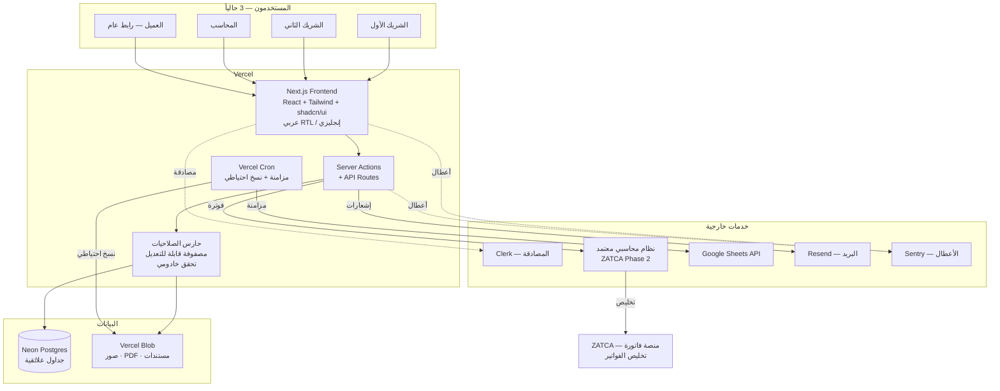

# وثيقة معمارية وخطة تنفيذ شاملة
## نظام إدارة الأعمال والمبيعات — شركة اندستريال تكنولوجيز (الرياض)

| | |
|---|---|
| **الإصدار** | 2.0 — القرارات الأساسية مثبّتة |
| **التاريخ** | 24 يوليو 2026 |
| **النطاق** | إعادة بناء كاملة لنظام mini_erp — من نموذج تجريبي إلى نظام تشغيلي معتمَد |
| **القطاع** | بيع معدات ورش السيارات وأفران الدهان الصناعية (B2B) |
| **الحالة** | ✅ جاهزة للتنفيذ — بانتظار فتح الحسابات |

### ما تغيّر في الإصدار 2.0

| # | القرار | الأثر |
|---|---|---|
| 1 | ✅ **تأكيد**: الإيرادات تتجاوز حد 375,000 ريال | الشركة **داخل نطاق** المرحلة الثانية لـZATCA والموعد مضى |
| 2 | ✅ **قرار**: شراء نظام فوترة معتمد مستقل | لن نبني الفوترة الضريبية — نربطها فقط (القسم 6) |
| 3 | ✅ **تحديد**: 3 مستخدمين (شريكان + محاسب) | إعادة تصميم نموذج الصلاحيات بالكامل (القسم 3) |
| 4 | ✅ **متطلب جديد**: الصلاحيات قابلة للتعديل داخل النظام | مصفوفة صلاحيات مرنة بدل أدوار ثابتة |
| 5 | 💰 **نتيجة**: التكلفة انخفضت | من ~230–350 إلى **~155–165 ريال/شهر** |

---

# 📑 الفهرس

| القسم | العنوان |
|---|---|
| 0 | الوضع التنظيمي — ZATCA |
| 1 | تحليل النظام السابق (قبل/بعد) |
| 2 | الحزمة التقنية والتكاليف |
| 3 | **نموذج المستخدمين والصلاحيات** ⭐ جديد |
| 4 | الربط مع Google Sheets |
| 5 | متطلبات واجهة المستخدم |
| 6 | الضريبة والمحاسبة — استراتيجية الربط |
| 7 | لوحة القرارات والتقارير |
| 8 | إدارة العملاء وما بعد البيع |
| 9 | صفحة المنتج |
| 10 | المخطط المعماري |
| 11 | الخارطة الزمنية التنفيذية |
| 12 | مقارنة الخيارات التقنية |
| 13 | الأسئلة المتبقية |
| 14 | خطوات البدء الفورية |

---

# 0. الوضع التنظيمي — ZATCA

## 0.1 الوضع المؤكَّد

| البند | الحالة |
|---|---|
| حد الموجة 24 | إيرادات خاضعة للضريبة > **375,000 ريال** في 2022 أو 2023 أو 2024 |
| وضع الشركة | ✅ **مؤكَّد: تتجاوز الحد** |
| الموعد النهائي | **30 يونيو 2026** — مضى قبل ~4 أسابيع |
| الموجات اللاحقة | لم تُعلن — المرحلة الثانية سارية عملياً على كل مسجَّل في الضريبة |
| القرار المتخذ | ✅ **شراء نظام فوترة معتمد مستقل** |

## 0.2 ما يتطلبه الامتثال فعلياً

المرحلة الثانية ليست «إضافة رمز QR» — بل منظومة كاملة:

| المتطلب | الوصف |
|---|---|
| صيغة XML | فاتورة بمعيار UBL 2.1 |
| الختم التشفيري | توقيع رقمي بشهادة **CSID** صادرة من الهيئة |
| تسلسل التجزئة (PIH) | كل فاتورة تحمل بصمة سابقتها — سلسلة غير قابلة للكسر |
| معرّف فريد | UUID لكل فاتورة |
| **التخليص اللحظي** | فواتير B2B (حالتك) تُرسَل للهيئة **قبل** تسليمها للعميل |
| الأرشفة | حفظ نظامي للفواتير والقيود |

**هذا بالضبط سبب قرار الشراء**: بناء هذه المنظومة من الصفر يستغرق أشهراً، ويحمل مخاطرة تنظيمية مستمرة (الهيئة تحدّث المواصفات دورياً)، والموعد أصلاً مضى.

## 0.3 إجراءات فورية (خارج البرمجة)

| # | الإجراء | المسؤول |
|---|---|---|
| 1 | تحديد الوضع الحالي والغرامات المحتملة | المحاسب القانوني |
| 2 | اختيار نظام فوترة معتمد وتفعيله | أنت + المحاسب |
| 3 | استخراج شهادة CSID والربط بمنصة فاتورة | مزوّد النظام |
| 4 | إصدار الفواتير الجارية عبره فوراً (ولو يدوياً) | المحاسب |

> ⚠️ لا تنتظر النظام الجديد. الامتثال يبدأ الآن ومستقل تماماً عن مشروع البرمجة.

---

# 1. تحليل النظام السابق

مبني على **قراءة كاملة للكود الفعلي** (4,326 سطراً + 5 ملفات API + إعدادات Firebase)، لا على انطباع.

## 1.1 نقاط القوة — تُنقَل بالكامل

النظام فشل تقنياً لكنه نجح في تجسيد **معرفة تشغيلية حقيقية عن شركتك**. هذه أثمن أصل ولا يجوز أن يضيع.

| # | نقطة القوة | الموضع في الكود | القيمة |
|---|---|---|---|
| 1 | **بوابات إنفاذ**: توقيع الشريكين فوق العتبة · لا تسليم دون سداد 100% | `jointNeeded()` · `renderDOs()` | ضوابط حوكمة تحمي مالك — نادرة في الأنظمة الجاهزة |
| 2 | **مصفوفة RACI** + سجل انتقال الصلاحيات | `RACI_SEED` | توزيع مسؤوليات مكتوب بين الشريكين |
| 3 | **التكلفة الفعلية (Landed Cost)** | `landedCost()` | جوهري لتجارة الاستيراد — يمنع تسعيراً خاسراً |
| 4 | **23 قيمة تشغيل قابلة للتعديل بلا كود** | `OPS_DEFAULTS` | النظام يتكيف مع نمو الشركة |
| 5 | **ترقيم مستندات** `PUR-2026-0001` | `nextNo()` | مطلب محاسبي (تسلسل غير منقطع) |
| 6 | **ثنائية اللغة** في كل شاشة ومستند | كامل الملف | ضرورة لموردي الصين وتركيا + العملاء |
| 7 | **تتبّع الضمان** بالرقم التسلسلي | `warrantyStatus()` | صميم عملك |
| 8 | **تصنيف الموردين** تلقائياً | `supClass()` | ضبط سلسلة التوريد |
| 9 | **إشعارات محسوبة** من البيانات | `computeNotifs()` | النظام ينبّهك بدل أن تبحث |
| 10 | **قوالب مستندات بهوية الشركة** | `buildDoc()` | مظهر احترافي أمام العميل |

## 1.2 نقاط الضعف

| # | الضعف | التفصيل | الخطورة |
|---|---|---|---|
| 1 | **الصلاحيات وهمية** | `/api/state` بلا مصادقة — أي شخص يعرف الرابط يقرأ ويكتب كل بيانات الشركة | 🔴 |
| 2 | **انهيار تبعية** | Firebase توقف كلياً (`CONSUMER_INVALID`) | 🔴 |
| 3 | **كل البيانات في صف واحد** | 29 كياناً كنص JSON في خانة واحدة | 🔴 |
| 4 | **لا نسخ احتياطي** | لا جدولة ولا اختبار استعادة | 🔴 |
| 5 | **لا امتثال ضريبي** | حساب 15% فقط — لا فاتورة إلكترونية | 🔴 |
| 6 | **لا مراقبة أعطال** | انهيار Firebase مرّ أسابيع بصمت | 🟠 |
| 7 | **لا اختبارات** | خطأ في حساب فاتورة قد يمر | 🟠 |
| 8 | **تعارض الكتابة** | جهازان يحفظان ⇒ آخر حفظ يمحو الأول | 🟠 |
| 9 | **الربط بالاسم النصي** | تعديل اسم عميل يقطع صلته بتاريخه | 🟠 |
| 10 | **ملف واحد 4,326 سطراً** | صيانة بطيئة | 🟡 |
| 11 | **لا PDF حقيقي** | طباعة متصفح فقط | 🟡 |
| 12 | **كود ميت** | 3 ملفات/استيرادات بلا استدعاء | 🟡 |

## 1.3 كيف كانت تُحفَظ البيانات

**البيانات الهيكلية** — جدول واحد، صف واحد:
```
Neon Postgres → app_state
   ├── id = 'erp:state'
   ├── value = "{ products:[], customers:[], quotes:[], ... }"  ← 29 كياناً
   └── updated_at
```

**الملفات** — Firestore (معطّل):
```
media/{id}         ← الصورة Base64 داخل مستند (حد 900KB)
auditLogs/{id}     ← سجل التدقيق
publicShares/{tok} ← روابط موافقة العميل
publicIntake/{id}  ← الشكاوى + مرفقاتها
publicProfile/main ← اسم وشعار الشركة
```

**نمط التسمية** (يُحفَظ): `{كود}-{سنة}-{تسلسل}` مثل `PUR-2026-0001` · أكواد إجراءات `SLS-001`, `QLT-002`, `FIN-001`

## 1.4 مقارنة قبل / بعد

| المحور | ❌ القديم | ✅ الجديد |
|---|---|---|
| البنية | ملف HTML واحد 4,326 سطراً | مشروع Next.js بوحدات ومكوّنات |
| اللغة | JavaScript بلا أنواع | TypeScript — الأخطاء تُكتشف قبل النشر |
| القاعدة | صف واحد يحوي JSON | جداول علائقية بقيود ومفاتيح أجنبية |
| الربط | مطابقة نصية بالاسم | مفاتيح أجنبية تفرضها القاعدة |
| الحفظ | استبدال كامل الحالة | تعديل السجل المعني داخل معاملة ذرية |
| التزامن | آخر حفظ يمحو ما قبله | معاملات ACID |
| المصادقة | Firebase منهار | Clerk — خدمة متخصصة |
| **الصلاحيات** | إخفاء أزرار فقط | **مصفوفة قابلة للتعديل + تحقق خادومي** |
| حماية API | مفتوحة للجميع | كل نقطة محمية بجلسة + صلاحية |
| الملفات | Base64 في Firestore | Vercel Blob |
| الفوترة | لا شيء | نظام معتمد ZATCA عبر API |
| PDF | طباعة متصفح | PDF فعلي يُرسَل بالبريد |
| النسخ الاحتياطي | لا يوجد | ثلاثي + اختبار استعادة شهري |
| مراقبة الأعطال | لا يوجد | Sentry |
| سجل التدقيق | على خدمة معطّلة | جدول مستقل: القيمة قبل/بعد |
| معرفة العمل | ✅ ممتازة | ✅ **تُنقَل وتُعزَّز بإنفاذ خادومي** |

---

# 2. الحزمة التقنية والتكاليف

> الأسعار تقريبية (3.75 ريال/دولار) وقابلة للتغيير — تحقق عند الشراء.

## 2.1 الواجهة الأمامية

| البند | التفصيل |
|---|---|
| **الاختيار** | Next.js 15+ (App Router) · TypeScript · Tailwind CSS · shadcn/ui |
| **السبب** | Vercel مطوّرة Next.js — أعمق توافق ممكن. نشر تلقائي + **رابط معاينة منفصل لكل تعديل** قبل أن يلمس النظام الحي. shadcn/ui تعطيك مكوّنات احترافية داخل مشروعك مباشرة |
| **RTL** | Tailwind يدعم الاتجاه المنطقي (`ms-`/`me-`) · توجيه حسب اللغة (`/ar`, `/en`) · خطوط Cairo + Tajawal (مستخدمة حالياً — للاستمرارية البصرية) |
| **البديل الأرخص** | نفسه (مجاني) |
| **البديل الأقوى** | + Framer Motion · Storybook — قيمة محدودة لحجمك |
| **التكلفة** | **0 ريال** |

## 2.2 الخلفية وقاعدة البيانات

| البند | التفصيل |
|---|---|
| **الاختيار** | Next.js Server Actions (لا خادوم منفصل) · **Neon Postgres** · **Prisma ORM** |
| **لماذا علائقية** | بيانات ERP مترابطة بصرامة. القيود يجب أن **تفرضها القاعدة** لا أن يتذكّرها الكود. المحاسبة تحتاج معاملات ذرية: دفعة + ذمم + تدقيق ⇒ الثلاثة معاً أو لا شيء |
| **لماذا Neon** | تكامل Marketplace أصلي مع Vercel · **التفرّع (Branching)**: نسخة كاملة من القاعدة لاختبار أي تعديل هيكلي دون خطر — شبكة أمان لمن يعمل بلا فريق مراجعة |
| **لماذا ORM** | بلا أنواع، خطأ في اسم عمود يظهر عند العميل لا وقت الكتابة. Prisma يوفّر هجرات منظّمة + `Prisma Studio` لتصفّح بياناتك بصرياً بنفسك |
| **البديل الأرخص** | Supabase (قاعدة + مصادقة + تخزين في اشتراك واحد) |
| **البديل الأقوى** | AWS RDS — مبالغة لحجمك |
| **التكلفة** | Vercel Pro ~75 ريال · Neon مجاني للبداية |

## 2.3 التخزين والنسخ الاحتياطي

### الملفات

| البند | التفصيل |
|---|---|
| **الاختيار** | **Vercel Blob** |
| **السبب** | منتج أول-طرف: لا حساب خارجي ولا فوترة منفصلة. يحل عطل «الصور المعطّلة» الموروث من Firebase. يدعم ملفات عامة (صور منتجات) وخاصة (فواتير، مستندات جمركية) |
| **التنظيم** | `products/{id}/{uuid}.webp` · `quotes/{no}.pdf` · `invoices/{سنة}/{no}/` · `shipments/{no}/{نوع}.pdf` |
| **البديل الأرخص** | Cloudflare R2 |
| **البديل الأقوى** | Cloudinary (تحويل صور متقدم) |
| **التكلفة** | ~20–30 ريال/شهر |

### النسخ الاحتياطي — 3 طبقات إلزامية

| الطبقة | الآلية | التردد | المكان |
|---|---|---|---|
| 1 | استعادة لنقطة زمنية (PITR) | مستمر | Neon |
| 2 | `pg_dump` مضغوط عبر Vercel Cron | يومي 3 ص | Vercel Blob (خاص) — **خارج Neon** |
| 3 | تحميل يدوي | شهري | جهازك/قرص خارجي — خارج السحابة |

**اختبار الاستعادة**: شهرياً على **فرع Neon مؤقت** والتحقق من تطابق عدد السجلات.
> نسخة احتياطية لم تُختبر استعادتها ليست نسخة احتياطية.

## 2.4 المصادقة

| البند | التفصيل |
|---|---|
| **الاختيار** | **Clerk** لتسجيل الدخول + جدول صلاحيات خاص في Neon |
| **السبب** | الدرس المباشر من انهيار نظامك: **لا تُدِر مصادقة بنفسك لنظام تعتمد عليه بالكامل**. Clerk: تكامل Marketplace أصلي، شاشات دخول احترافية، تحقق بخطوتين، إدارة جلسات آمنة — بلا كود منك |
| **البديل الأرخص** | Supabase Auth · Auth.js (مجاني لكن الأمان مسؤوليتك) |
| **البديل الأقوى** | Auth0 / WorkOS (دخول مؤسسي SSO) — لا حاجة حالياً |
| **التكلفة** | مجاني حتى 10,000 مستخدم — **0 ريال** (لديك 3) |

## 2.5 أدوات مساندة من اليوم الأول

| الأداة | الغرض | لماذا الآن | التكلفة |
|---|---|---|---|
| **Sentry** | مراقبة الأعطال | بلا فريق يراقب، أي عطل يمر بصمت — كما حدث مع Firebase | 0 ريال |
| **Resend** | إشعارات بريدية | عرض سعر · تنبيه مخزون · تذكير سداد | 0 ريال (3,000 رسالة/شهر) |
| **@react-pdf/renderer** | PDF فعلي | عروض الأسعار تُرسَل كمرفق لا كطباعة شاشة | 0 ريال |
| **Vitest + Playwright** | اختبارات | المسارات المالية فقط — بديلك عن فريق مراجعة | 0 ريال |

## 2.6 التكلفة الشهرية (3 مستخدمين)

| الخدمة | الخطة | التكلفة |
|---|---|---|
| Vercel | Pro *(الاستخدام التجاري يتطلب Pro لا Hobby)* | ~75 ريال |
| Neon | مجانية → Launch عند النمو | 0 → ~71 ريال |
| Clerk | مجانية (3 من 10,000) | **0 ريال** |
| Sentry | مجانية | **0 ريال** |
| Resend | مجانية | **0 ريال** |
| Vercel Blob | حسب الاستهلاك | ~20–30 ريال |
| نظام الفوترة المعتمد | — | ~60 ريال |
| **الإجمالي** | | **~155–165 ريال/شهر** |

> للمقارنة: نظام ERP جاهز لشركة بحجمك يكلف 1,500–5,000 ريال شهرياً، ولا يمنحك بوابات الإنفاذ ولا Landed Cost ولا RACI المخصصة لشركتك.

---

# 3. نموذج المستخدمين والصلاحيات ⭐

> هذا القسم أُعيد تصميمه بالكامل بناءً على متطلبك: **صلاحيات قابلة للتعديل داخل النظام**، لا أدوار ثابتة في الكود.

## 3.1 المستخدمون الحاليون

| # | المستخدم | القالب المبدئي | قابل للتعديل |
|---|---|---|---|
| 1 | الشريك الأول | شريك — صلاحيات كاملة | ✅ |
| 2 | الشريك الثاني | شريك — صلاحيات كاملة | ✅ |
| 3 | المحاسب | محاسب | ✅ |

**التوسّع مستقبلاً**: إضافة مبيعات أو مخزون أو فني تركيب **بلا أي برمجة** — تُنشئ المستخدم، تختار قالباً، تعدّل ما تشاء.

## 3.2 بنية الصلاحيات — ثلاث طبقات

### أ) الوصول للوحدات (لكل شاشة على حدة)

أربع صلاحيات مستقلة: **عرض · إنشاء · تعديل · حذف**

| # | الوحدة | # | الوحدة |
|---|---|---|---|
| 1 | لوحة التحكم | 11 | المخزون |
| 2 | العملاء | 12 | الدفعات والذمم |
| 3 | الموردون | 13 | المصروفات والعهد |
| 4 | المنتجات | 14 | الصيانة والضمان |
| 5 | عروض الأسعار | 15 | الشكاوى |
| 6 | أوامر البيع | 16 | الرواتب |
| 7 | إذون التسليم | 17 | التقارير |
| 8 | طلبات الشراء | 18 | سجل التدقيق |
| 9 | أوامر الشراء | 19 | الإعدادات والمستخدمون |
| 10 | الشحنات والمستوردات | | |

### ب) صلاحيات مالية حساسة

| الصلاحية | الأثر |
|---|---|
| 👁 **رؤية التكاليف والهوامش** | إخفاء سعر التكلفة وهامش الربح عمّن لا يملكها |
| 💰 **رؤية الرواتب** | حجب شاشة الرواتب وأرقامها |
| ✍️ **توقيع الشريك** | المشاركة في بوابة التوقيع المزدوج فوق العتبة |
| ✅ **اعتماد المصروفات** | إقرار المصروفات والعهد |

### ج) صلاحيات إدارية

| الصلاحية | الأثر |
|---|---|
| 👤 **إدارة المستخدمين** | إضافة/تعطيل مستخدم وتعديل صلاحياته |
| ⚙️ **تعديل عتبات التشغيل** | تغيير العتبات المالية والمهل والأهداف |
| 📤 **تصدير البيانات** | تنزيل CSV/Excel |
| 🕵️ **عرض سجل التدقيق** | الاطلاع على من فعل ماذا ومتى |

## 3.3 القوالب الجاهزة (نقطة بداية — كلها قابلة للتعديل)

| الصلاحية | شريك | محاسب | مبيعات | مخزون |
|---|:---:|:---:|:---:|:---:|
| العملاء | كامل | عرض | كامل | عرض |
| الموردون | كامل | عرض | — | عرض |
| المنتجات | كامل | عرض | عرض | عرض + تعديل |
| عروض الأسعار | كامل | عرض | كامل | — |
| أوامر البيع | كامل | عرض | كامل | عرض |
| إذون التسليم | كامل | عرض | عرض | كامل |
| طلبات/أوامر الشراء | كامل | عرض | — | إنشاء |
| الشحنات والمستوردات | كامل | عرض + تعديل | — | كامل |
| المخزون | كامل | عرض | عرض | كامل |
| الدفعات والذمم | كامل | **كامل** | عرض | — |
| المصروفات والعهد | كامل | **كامل** | — | — |
| الصيانة والشكاوى | كامل | عرض | عرض | عرض |
| الرواتب | كامل | ⚠️ *قرارك* | — | — |
| التقارير | كامل | كامل | جزئي | جزئي |
| سجل التدقيق | ✅ | ✅ | — | — |
| المستخدمون والإعدادات | ✅ | — | — | — |
| 👁 التكاليف والهوامش | ✅ | ✅ | — | ✅ |
| 💰 الرواتب | ✅ | ⚠️ *قرارك* | — | — |
| ✍️ توقيع الشريك | ✅ | — | — | — |

> ⚠️ **قرار يحتاج رأيك**: هل يرى المحاسب رواتب الشريكين؟ عملياً هو من يعالج الرواتب، لكن هذا قرارك أنت. الافتراضي المقترح: نعم، مع إمكانية إخفائها بنقرة.

## 3.4 حواجز أمان مبنية في النظام

| الحاجز | السبب |
|---|---|
| 🔒 **لا يمكن نزع «إدارة المستخدمين» من آخر مالك لها** | وإلا أقفلت نفسك خارج نظامك نهائياً |
| 🔒 **تحذير عند بقاء حامل واحد لـ«توقيع الشريك»** | بوابة التوقيع المزدوج تتعطّل بحاملٍ واحد |
| 🔒 **لا يمكن للمستخدم تعديل صلاحيات نفسه** | يمنع رفع الصلاحيات ذاتياً |
| 🔒 **كل تغيير صلاحية يُسجَّل في التدقيق** | من غيّر ماذا لمن ومتى |
| 🔒 **التحقق خادومي دائماً** | لا مجرد إخفاء زر — الرفض يحدث قبل تنفيذ العملية |

## 3.5 ⚠️ ملاحظة رقابية صريحة

بشريكين لهما صلاحية كاملة، **فصل المهام ضعيف بطبيعته**: نفس الشخص يستطيع إنشاء أمر شراء واعتماده وتسجيل دفعته. هذه ليست مشكلة برمجية بل واقع فريق من ثلاثة.

**الضوابط التعويضية المتاحة:**

| الضابط | التفصيل |
|---|---|
| 1. بوابة التوقيع المزدوج | فوق العتبة المالية، توقيع الشريكين إلزامي (موجودة في نظامك — تُبقى وتُفرَض خادومياً) |
| 2. سجل تدقيق بالقيمة قبل/بعد | كل تعديل حساس موثّق ولا يُحذف |
| 3. **مراجعة شهرية للسجل** | عشر دقائق شهرياً بين الشريكين — أفضل ضابط متاح بهذا الحجم |
| 4. فصل المحاسب | المحاسب يسجّل الدفعات ولا يعتمد المشتريات الكبيرة |

---

# 4. الربط مع Google Sheets

## 4.1 قرار معماري: اتجاه واحد

**التوصية: مزامنة أحادية (النظام ← Sheets)، لا ثنائية.**

| | أحادية ✅ | ثنائية ❌ |
|---|---|---|
| مصدر الحقيقة | واضح: قاعدة البيانات | غامض عند التعارض |
| فساد البيانات | معدوم | عالٍ — صيغة خاطئة تفسد سجلاً محاسبياً |
| القيود | محفوظة | يمكن تجاوزها بالكتابة المباشرة |
| التعقيد | بسيط | يحتاج منطق حل تعارضات |

الشيت = **نافذة عرض ومشاركة وتحليل**، لا مصدر إدخال.

## 4.2 خطوات التنفيذ

**1. مشروع Google Cloud** → [console.cloud.google.com](https://console.cloud.google.com) بحساب الشركة → مشروع `industrial-tech-erp` → فعّل **Google Sheets API** و**Drive API**

**2. حساب خدمة** → Credentials → Create Service Account (`erp-sheets-writer`) → Keys → JSON
> ⚠️ ملف المفاتيح سرّ مطلق — لا يُرفع لـGit إطلاقاً

**3. متغيرات البيئة في Vercel**
```
GOOGLE_SERVICE_ACCOUNT_EMAIL   ← ينتهي بـ .iam.gserviceaccount.com
GOOGLE_PRIVATE_KEY
GOOGLE_SHEET_ID
```

**4. الشيت** → ملف `ITCO — ERP Live Data` → شاركه مع بريد حساب الخدمة كـ**محرِّر** → تبويبات: المنتجات · العملاء · عروض الأسعار · أوامر البيع · المخزون · الدفعات · الشحنات

**5. البناء** → مكتبة `googleapis` · نمط **مسح التبويب ثم كتابته كاملاً** (أضمن من تحديث صفوف مفردة) · صف عناوين مجمّد · عمود «آخر تحديث»

**6. الجدولة** → Vercel Cron يستدعي نقطة نهاية محمية بمفتاح سري

## 4.3 التردد

| البيانات | التردد | السبب |
|---|---|---|
| المخزون | كل ساعة | يتغير كثيراً وقرارات الشراء تعتمد عليه |
| المبيعات | كل 4 ساعات | متابعة كافية |
| العملاء | يومياً | نادر التغيير |
| الدفعات والذمم | يومياً 6 ص | لمراجعة المحاسب الصباحية |
| الشحنات | يومياً | دورتها بالأسابيع |
| لقطة KPI | يومياً منتصف الليل | صف جديد لبناء تاريخ اتجاهات |

> **حدود**: ~60 طلباً/دقيقة · 10 ملايين خلية للملف — التردد أعلاه بعيد جداً عن الحدود.

## 4.4 مخاطر وتخفيفها

| الخطر | التخفيف |
|---|---|
| تسرّب مفتاح الخدمة | لا يُرفع لـGit · تدوير سنوي |
| رواتب وتكاليف في شيت مشترك | **ملف منفصل** بصلاحيات أضيق |
| شخص يعدّل الشيت ظاناً أنه النظام | تبويب أول: «للعرض فقط — التعديل يُمحى عند المزامنة» |
| فشل مزامنة صامت | تنبيه Sentry + بريد عند فشل Cron |

---

# 5. متطلبات واجهة المستخدم

## 5.1 المبادئ

| المبدأ | التطبيق |
|---|---|
| **بسيط وحديث** | مساحة بيضاء · هوية ITCO (كحلي `#0E2342` + أحمر `#DA291C`) · بلا زخرفة |
| **خفيف وسريع** | تحميل أول < ثانيتين على 3G · Server Components · صور WebP |
| **متجاوب فعلاً** | يبدأ من الجوال — الشريك في السوق بجواله، المحاسب بلابتوبه |
| **RTL كامل** | العربية افتراضية · تبديل فوري للإنجليزية · الأرقام LTR دائماً |

## 5.2 نظام «ماذا الآن؟ وما التالي؟»

| الطبقة | الوصف | مثال |
|---|---|---|
| 1. **شريط سياق** أعلى كل شاشة | ما هذه الشاشة + الخطوة التالية | «عروض الأسعار: أنشئ عرضاً واعتمده. **التالي**: عند القبول ← حوّله لأمر بيع» |
| 2. **مؤشر تقدّم** للمستندات | موقعك في الدورة | `عرض سعر ← ✅ أمر بيع ← 🔵 دفعة مقدمة ← ⚪ تسليم` |
| 3. **تلميحات** `؟` | شرح كل حقل غامض | «التكلفة الفعلية: تُحسب من آخر شراء + الشحن + الجمارك» |
| 4. **إرشاد أولي** | جولة 5 خطوات حسب الصلاحيات | المحاسب ← الذمم · الشريك ← لوحة القرارات |

> نظامك السابق فيه `HELP_MAP` بهذا المعنى — **نُبقي المحتوى ونحسّن العرض**.

## 5.3 لوحة «ابدأ يومك»

اللوحة تُبنى **حسب صلاحيات المستخدم** لا حسب دور ثابت:

- **الشريك**: نقد متاح · صفقات تحتاج توقيعك · تنبيهات حمراء
- **المحاسب**: دفعات لتسجيلها · ذمم متأخرة · موعد الإقرار الضريبي
- **مستقبلاً (مبيعات)**: عروض تحتاج متابعة · صفقات راكدة · مهام اليوم
- **مستقبلاً (مخزون)**: منتجات تحت الحد · شحنات واردة · طلبات تجهيز

---

# 6. الضريبة والمحاسبة — استراتيجية الربط

## 6.1 فصل الطبقتين (القرار المعتمد)

```
نظامك المخصص (تبنيه)              نظام معتمد (تشتريه)
──────────────────────             ────────────────────
عروض الأسعار                        الفاتورة الضريبية الرسمية
دورة الموافقات والتوقيع   ──API──▶   الختم التشفيري + UUID + QR
المخزون والمستوردات                  التخليص عبر منصة فاتورة
CRM والصيانة والضمان                 الإقرار الضريبي الربعي
Landed Cost و RACI                  دفتر الأستاذ والقيود
```

**آلية العمل**: عند تحويل أمر بيع إلى فاتورة، نظامك يرسل البيانات عبر API → النظام المعتمد يُصدر الفاتورة المتوافقة ويخلّصها → يعيد لك رقمها و QR ورابط PDF → تحفظها مرجعياً وتعرضها للعميل.

## 6.2 مقارنة الأنظمة المعتمدة

| النظام | الميزة الأبرز | السعر التقريبي | ملاحظة |
|---|---|---|---|
| **Zoho Books (نسخة السعودية)** | الأرخص · **API ناضج جداً** | ~60 ريال/شهر (3 مستخدمين) | ⭐ الأنسب للربط البرمجي |
| **Wafeq** | أفضل تجربة ثنائية اللغة · سعودي | متوسط | واجهة مريحة للمحاسب |
| **Qoyod** | سعودي (الرياض) · قريب من الأعراف المحلية | متوسط | قوي للخدمات والمشاريع |

**توصيتي**: **Zoho Books KSA** — أقل تكلفة وأنضج واجهة برمجية، وهو ما تحتاجه بما أن نظامك سيتحدث معه آلياً.

> ⚠️ تحقق من ورود النظام في **الدليل الرسمي المعتمد** لدى الهيئة قبل الشراء — القوائم تتغير.
> 💡 **سؤال حاسم قبل الشراء**: هل يوفر النظام **API لإنشاء الفواتير برمجياً**؟ بعض الأنظمة الرخيصة تعمل بالواجهة فقط — وهذا يُبطل فكرة الربط الآلي كلياً.

## 6.3 ما يبقى في نظامك

| العنصر | التفصيل |
|---|---|
| **شجرة الحسابات** | `COA_SEED` الموجود يُنقَل ويُربَط بشجرة النظام المحاسبي · الريال أساسي · دعم USD/CNY/TRY للمستوردات |
| **لوحة الضريبة الربعية** | ضريبة المخرجات (مبيعات 15%) · المدخلات (مشتريات ومستوردات) · الصافي — **للمراجعة والتخطيط**، بينما الإقرار الرسمي من النظام المعتمد |
| **الأرشفة** | كل فاتورة (XML + PDF + QR) في Blob بتنظيم `invoices/{سنة}/{رقم}/` + سجل تدقيق غير قابل للتعديل. **مدة الاحتفاظ يحدّدها محاسبك** |
| **الربط المرجعي** | كل فاتورة تحمل معرّفها في النظام المعتمد — تتبّع من عرض السعر حتى الإقرار |

---

# 7. لوحة القرارات والتقارير

## 7.1 المعمارية

حساب مباشر من Postgres باستعلامات مُفهرَسة — لا حاجة لمستودع بيانات بحجمك. عند تجاوز ~100 ألف سجل، ننتقل لجداول تجميع ليلية.

## 7.2 أداء المبيعات

| البُعد | المؤشرات |
|---|---|
| **حسب المنتج** | الإيراد · الكمية · هامش الربح (بعد Landed Cost) · معدل التحويل |
| **حسب العميل** | إجمالي المشتريات · متوسط الصفقة · آخر شراء · الذمم القائمة |
| **حسب المنطقة** | الرياض / جدة / الدمام / أخرى |
| **حسب الفترة** | شهري وربعي وسنوي + مقارنة بالفترة المماثلة |
| **قمع المبيعات** | محتمل ← عرض ← أمر ← تسليم، مع نسبة التسرّب |

## 7.3 المخزون

| المؤشر | الحساب | القرار المدعوم |
|---|---|---|
| الكمية الحالية | وارد − صادر | هل أستطيع البيع الآن؟ |
| **معدل الدوران** | تكلفة المبيعات ÷ متوسط المخزون | أي منتج يحرّك رأس مالي |
| **نقطة إعادة الطلب** | (الاستهلاك اليومي × مدة التوريد) + مخزون أمان | **متى أطلب من الصين/تركيا** — حرج لأن التوريد بالأسابيع |
| **الراكد** | بلا حركة > 180 يوماً | رأس مال مجمّد |
| قيمة المخزون | الكمية × التكلفة الفعلية | أصل في الميزانية |

## 7.4 المستوردات (خاص بطبيعة عملك)

| المؤشر | الوصف |
|---|---|
| **زمن التوريد الفعلي** | من أمر الشراء للاستلام — **لكل مورد** (الصين ≠ تركيا) |
| **تفكيك التكلفة** | البضاعة · الشحن · الجمارك · التخليص · النقل ⇒ **التكلفة النهائية للوحدة** |
| **دقة المورد** | الفارق بين الموعد الموعود والفعلي — يغذّي التصنيف |
| **أثر سعر الصرف** | الدولار/اليوان/الليرة على تكلفة الشحنة |
| **الشحنات الجارية** | قيد الإنتاج · شُحنت · في الميناء · تخليص · وصلت |

## 7.5 مؤشرات الأداء

كل مؤشر: **القيمة · الهدف · اتجاه (▲▼) · رسم اتجاه صغير**

| الفئة | المؤشرات |
|---|---|
| مالية | الإيراد · الهامش % · النقد المتاح · متوسط أيام التحصيل |
| مبيعات | صفقات مغلقة · معدل التحويل · متوسط الصفقة |
| تشغيل | زمن التوريد · التسليم في الموعد % · دقة الجرد % |
| خدمة | زمن الاستجابة الأولى · إقفال الشكاوى ضمن المهلة % |

**التقنية**: Recharts — خفيفة، تحترم RTL، تصدير كصورة أو CSV.

---

# 8. إدارة العملاء وما بعد البيع

## 8.1 دورة حياة الطلب

```
عميل محتمل ← عرض سعر ← موافقة العميل ← أمر بيع ← دفعة مقدمة
   ← تجهيز/استيراد ← جاهز للشحن ← مشحون ← تسليم وتركيب ← مكتمل
```

كل انتقال يسجّل: **من · متى · ملاحظة** ويُشعِر المعنيين. العميل يتابع طلبه عبر **رابط عام آمن** (تطوير لفكرة `publicShares` الموجودة).

## 8.2 طلبات الصيانة

| الأولوية | مهلة الاستجابة | التصعيد |
|---|---|---|
| 🔴 حرج (توقف إنتاج العميل) | 4 ساعات | فوري للشريك |
| 🟠 عالٍ (ضمان) | 24 ساعة | بعد 48 ساعة |
| 🟡 عادي | 3 أيام عمل | بعد 5 أيام |
| ⚪ منخفض | 7 أيام | — |

يشمل: ربط تلقائي بحالة الضمان عبر الرقم التسلسلي · تعيين منفّذ · تذكيرات · تقييم العميل بعد الإغلاق · **صيانة وقائية مجدولة** (إيراد متكرر لمعدات صناعية).

## 8.3 عروض الأسعار

- تحويل بنقرة: **عرض ← أمر بيع ← فاتورة** بلا إعادة إدخال
- إصدارات متعددة مع حفظ التاريخ (v1, v2, v3)
- صلاحية زمنية + تنبيه قبل انتهائها
- موافقة إلكترونية من العميل عبر رابط
- PDF احترافي يُرسَل بالبريد مباشرة

---

# 9. صفحة المنتج

## 9.1 الصور
صور متعددة (رئيسية + معرض + مخططات فنية) · تحسين تلقائي WebP بأحجام متعددة وتحميل كسول · `products/{id}/{uuid}.webp`

## 9.2 الشروط والأحكام
شروط عامة + **شروط خاصة بالمنتج** (تركيب، تدريب، قطع غيار) · **إصدارات مؤرشفة**: كل عرض سعر يحفظ الشروط السارية وقت إصداره — حماية قانونية

## 9.3 الضمان
المدة بالأشهر · نقطة البدء (تسليم أم تركيب) · ما يشمله ويستثنيه · شروط الإبطال · ربط تلقائي بالرقم التسلسلي وطلبات الصيانة

## 9.4 المواصفات التقنية
حقول مرنة حسب الفئة (فرن دهان: الأبعاد، قوة المحرك، الفلاتر، استهلاك الطاقة...) · ثنائية اللغة · ملف PDF قابل للتحميل · **جدول مقارنة بين المنتجات** — أداة بيع فعّالة

---

# 10. المخطط المعماري



## تدفق صفقة نموذجية

```
1. إنشاء عرض سعر ──▶ Postgres
2. توليد PDF ──▶ Blob ──▶ بريد للعميل (Resend)
3. موافقة العميل عبر رابط عام ──▶ تحديث الحالة
4. تحويل لأمر بيع ──▶ تحقق صلاحية خادومي
5. تجاوز العتبة؟ ──▶ بوابة توقيع الشريكين
6. تسجيل الدفعة ──▶ معاملة ذرية (دفعة + ذمم + تدقيق)
7. سداد كامل؟ ──▶ فتح بوابة التسليم
8. إصدار الفاتورة ──▶ API النظام المعتمد ──▶ ZATCA ──▶ QR + UUID
9. الأرشفة ──▶ Blob · المزامنة ──▶ Google Sheets
```

---

# 11. الخارطة الزمنية التنفيذية

> المدد تقديرية بعمل مركّز. معيار الاكتمال **ليس** «الكود يعمل» بل اختبار محدد ينجح.

## 🔴 المرحلة 0 — الامتثال الضريبي (جارية الآن، مستقلة)

| المهمة | الحالة |
|---|---|
| تأكيد الوضع مع المحاسب | ⏳ |
| اختيار نظام معتمد **مع التأكد من توفر API** | ⏳ |
| استخراج CSID والربط بمنصة فاتورة | ⏳ |
| إصدار الفواتير الجارية عبره | ⏳ |

**معيار الاكتمال**: إصدار فاتورة حقيقية متوافقة بنجاح ✅

---

## المرحلة 1 — التأسيس (أسبوع 1–2)

مشروع Next.js + TypeScript + Tailwind + shadcn/ui · ربط Vercel · Neon · Clerk · Blob · Sentry · هيكل RTL/LTR · خط النشر (Git ← معاينة ← إنتاج)

**معيار الاكتمال**: صفحة منشورة تقرأ من القاعدة + خطأ متعمّد يظهر في Sentry ✅

---

## المرحلة 2 — قاعدة البيانات (أسبوع 2–3)

كل الجداول والعلاقات والقيود: الشركة · **المستخدمون والصلاحيات** · العملاء · الموردون · المنتجات (مواصفات + ضمان) · عروض الأسعار وبنودها · أوامر البيع · إذون التسليم · طلبات وأوامر الشراء · الشحنات · المخزون · الدفعات · المصروفات · شجرة الحسابات · سجل التدقيق · الصيانة

**معيار الاكتمال**: إدخال بيانات مخالفة (دفعة على فاتورة غير موجودة، كمية سالبة) **يُرفَض من القاعدة نفسها** ✅

---

## المرحلة 3 — المصادقة والصلاحيات (أسبوع 3–4)

Clerk · **شاشة إدارة المستخدمين ومصفوفة الصلاحيات** · القوالب الجاهزة · حواجز الأمان (3.4) · الحارس الخادومي الموحّد · سجل التدقيق

**معيار الاكتمال**: إنشاء الحسابات الثلاثة · تعديل صلاحية المحاسب من الواجهة يُطبَّق فوراً · محاولة وصول لرابط محظور تُرفَض **خادومياً** وتُسجَّل ✅

---

## المرحلة 4 — البيانات الأساسية (أسبوع 4–6)

المنتجات (صور + مواصفات + ضمان + شروط) · العملاء · الموردون · البحث والتصفية · إخفاء التكاليف حسب الصلاحية

**معيار الاكتمال**: إدخال 10 منتجات حقيقية بصورها ومواصفاتها ✅

---

## المرحلة 5 — دورة المبيعات (أسبوع 6–9) 🎯 *الأهم*

عروض الأسعار (إصدارات + PDF + بريد) · موافقة العميل برابط · التحويل لأمر بيع · **بوابة توقيع الشريكين** · الدفعات · **بوابة لا تسليم دون سداد** · إذن التسليم · **الربط بنظام الفوترة المعتمد**

**معيار الاكتمال**: صفقة حقيقية كاملة من عرض سعر حتى فاتورة متوافقة، والبوابتان تمنعان التجاوز فعلياً ✅

> 🎯 **من هنا يصبح النظام صالحاً للاستخدام اليومي.**

---

## المرحلة 6 — المشتريات والمخزون والمستوردات (أسبوع 9–12)

طلبات وأوامر الشراء · الشحنات وتتبّعها · **Landed Cost** · حركات المخزون · نقاط إعادة الطلب · تنبيهات بريدية · تقييم الموردين

**معيار الاكتمال**: شحنة استيراد كاملة والتكلفة النهائية للوحدة تطابق حسابك اليدوي ✅

---

## المرحلة 7 — المالية والتقارير (أسبوع 12–15)

الذمم · المصروفات والعهد · شجرة الحسابات · لوحة الضريبة الربعية · تقارير المبيعات والمخزون والمستوردات · KPIs بالرسوم

**معيار الاكتمال**: تقرير ذمم يطابق كشف حسابك يدوياً · لوحة الضريبة تطابق النظام المحاسبي ✅

---

## المرحلة 8 — العملاء والخدمة (أسبوع 15–17)

متابعة الطلبات · طلبات الصيانة بالأولويات · الشكاوى · تتبّع الضمان · بوابة العميل · الصيانة الوقائية

**معيار الاكتمال**: طلب صيانة حقيقي يمر بالدورة كاملة حتى الإغلاق والتقييم ✅

---

## المرحلة 9 — التكاملات والتشغيل (أسبوع 17–19)

مزامنة Google Sheets · **النسخ الاحتياطي الثلاثي مع اختبار استعادة فعلي** · الإشعارات · مراجعة أمنية · نقل RACI والدليل

**معيار الاكتمال**: استعادة نسخة احتياطية على فرع مؤقت تنجح وتطابق الأصل · الشيت يتحدث تلقائياً ✅

---

## المرحلة 10 — الإطلاق (أسبوع 19–20)

تدريب قصير · إدخال البيانات الحقيقية · تشغيل موازٍ أسبوعين · إيقاف النظام القديم

**معيار الاكتمال**: أسبوعان تشغيل فعلي بلا عطل حرج ✅

---

## الملخص الزمني

| المرحلة | المدة | التراكمي |
|---|---|---|
| 0 — الامتثال | جارية | 🔴 مستقلة ومتوازية |
| 1–3 — الأساس والصلاحيات | 4 أسابيع | شهر |
| 4–5 — **نظام قابل للاستخدام** | 5 أسابيع | 🎯 **شهران وربع** |
| 6–7 — المخزون والمالية | 6 أسابيع | ~4 أشهر |
| 8–9 — الخدمة والتكاملات | 4 أسابيع | ~5 أشهر |
| 10 — الإطلاق | أسبوع | **~5 أشهر** |

---

# 12. مقارنة الخيارات التقنية

| المكوّن | الموصى به | الأرخص | الأقوى | فارق الوقت |
|---|---|---|---|---|
| الواجهة | Next.js + shadcn/ui | نفسه (0 ر) | + Framer Motion | — |
| الاستضافة | Vercel Pro (~75 ر) | Hobby (غير مناسب تجارياً) | Enterprise | — |
| القاعدة | Neon (0–71 ر) | Supabase (0 ر) | AWS RDS (~400 ر) | Supabase −3 أيام |
| ORM | Prisma | Drizzle | Prisma + Accelerate | متقارب |
| المصادقة | Clerk (**0 ر**) | Supabase Auth (0 ر) | Auth0 / WorkOS | Auth.js +5 أيام |
| التخزين | Vercel Blob (~30 ر) | Cloudflare R2 | Cloudinary | — |
| **الفوترة** | Zoho Books KSA (~60 ر) | نفسه | Wafeq / Qoyod | البناء الذاتي **+3 أشهر ومخاطرة تنظيمية** |
| الأعطال | Sentry (0 ر) | سجلات Vercel | Datadog | — |
| البريد | Resend (0 ر) | نفسه | SendGrid | — |
| التقارير | Recharts | نفسه | Metabase مستقل | Metabase +أسبوع |

## سيناريوهات مجمّعة

| السيناريو | الحزمة | الشهري | الوقت |
|---|---|---|---|
| الاقتصادي | Supabase (كل شيء) + Zoho | ~60–100 ر | ~4.5 شهر |
| **الموصى به** ⭐ | Vercel Pro + Neon + Clerk + Blob + Zoho | **~155–165 ر** | ~5 أشهر |
| المتقدم | + Metabase + Datadog + Cloudinary | ~700–900 ر | ~6 أشهر |

---

# 13. الأسئلة المتبقية

## ✅ أُجيبت

| # | السؤال | الإجابة |
|---|---|---|
| 1 | تجاوز حد 375,000 ريال؟ | ✅ نعم — داخل النطاق |
| 2 | نظام فوترة معتمد؟ | ✅ سيُشترى |
| 3 | عدد المستخدمين وأدوارهم؟ | ✅ 3 — شريكان + محاسب |
| 4 | الصلاحيات ثابتة أم مرنة؟ | ✅ مرنة قابلة للتعديل |

## 🟠 تحجب المرحلة 2 (تصميم القاعدة)

| # | السؤال | لماذا يهم |
|---|---|---|
| 5 | **حجم العمليات شهرياً؟** (عروض / أوامر / شحنات) | يحدد الفهرسة واستراتيجية التقارير |
| 6 | **كم منتجاً في الكتالوج؟ وكم مورداً؟** | يحدد بنية الفئات والمواصفات |
| 7 | **هل تحتاج تتبّع رقم تسلسلي لكل وحدة، أم كميات فقط؟** | فارق جوهري في تصميم المخزون والضمان |
| 8 | **هل لديك مستودع فعلي، أم شحن مباشر من المورد للعميل أحياناً؟** | يحدد نموذج حركات المخزون |
| 9 | **الدفع: دفعة مقدمة + رصيد فقط، أم دفعات مجدولة/تقسيط؟** | يحدد جدول الدفعات والذمم |
| 10 | **بعملات المستوردات: تسجّل بعملة المورد أم بالريال عند الشراء؟** | يحدد حقول العملة وسعر الصرف |

## 🟡 تحجب مراحل لاحقة

| # | السؤال | المرحلة |
|---|---|---|
| 11 | هل المحاسب يرى رواتب الشريكين؟ | 3 |
| 12 | فريق تركيب داخلي أم مقاولون؟ | 6 |
| 13 | الصيانة الوقائية: عقود أم عند الطلب؟ | 8 |
| 14 | بوابة عميل كاملة (بحساب) أم روابط عامة تكفي؟ | 8 |
| 15 | هل توجد بيانات حقيقية في Excel نستوردها؟ | 4 |

## 🔵 تشغيلية

| # | السؤال |
|---|---|
| 16 | هل تملك حساب Google Workspace للشركة؟ (مطلوب لـSheets) |
| 17 | هل عندك نطاق خاص؟ (مثل `erp.itco.sa` بدل رابط Vercel) |
| 18 | هل ستشارك في التطوير أم أتولاه كاملاً وأنت تختبر؟ |

---

# 14. خطوات البدء الفورية

## ما أحتاجه منك (فتح الحسابات — لا أستطيع الوصول لحساباتك)

| # | الحساب | الرابط | الخطة | ملاحظة |
|---|---|---|---|---|
| 1 | **Neon** | عبر Vercel Marketplace | مجانية | متغيرات البيئة تُضبط تلقائياً |
| 2 | **Clerk** | عبر Vercel Marketplace | مجانية | 3 مستخدمين من 10,000 |
| 3 | **Sentry** | sentry.io | مجانية | اختر Next.js |
| 4 | **Resend** | resend.com | مجانية | يحتاج تحقق نطاق للإرسال باسمك |
| 5 | **Vercel** | حسابك الحالي | ترقية لـPro | الاستخدام التجاري يتطلبها |

> سأرشدك خطوة بخطوة في كل حساب حين نصل إليه — لا حاجة لفتحها كلها الآن.

## ما أتولاه بالتوازي

| # | المهمة |
|---|---|
| 1 | تجهيز مشروع Next.js + TypeScript + Tailwind + shadcn/ui |
| 2 | هيكل ثنائي اللغة RTL/LTR بهوية ITCO |
| 3 | تصميم مخطط قاعدة البيانات (Prisma Schema) |
| 4 | بنية مصفوفة الصلاحيات والحارس الخادومي |
| 5 | إعداد خط النشر والمعاينة الآمنة |

## بالتوازي تماماً (مستقل عن البرمجة)

🔴 **الامتثال الضريبي** — راجع محاسبك واشترِ النظام المعتمد. لا تنتظر النظام الجديد.
💡 عند الشراء: **تأكد من توفر API لإنشاء الفواتير برمجياً** — بدونه يسقط الربط الآلي.

---

# الخلاصة

| البند | القرار |
|---|---|
| **الأولوية القصوى** | 🔴 الامتثال الضريبي — الموعد مضى، والمسار مستقل ومتوازٍ |
| **القرار المعماري الأهم** | فصل الفوترة المعتمدة (تُشترى) عن نظام الأعمال (يُبنى) |
| **الحزمة** | Next.js · TypeScript · Neon · Prisma · Clerk · Blob · Sentry · Resend |
| **الصلاحيات** | مصفوفة مرنة قابلة للتعديل داخل النظام + تحقق خادومي |
| **المدة** | ~5 أشهر · **نظام قابل للاستخدام بعد شهرين وربع** |
| **التكلفة** | **~155–165 ريال/شهر** |
| **الأصل الأثمن المنقول** | RACI · بوابات الإنفاذ · Landed Cost · تتبّع الضمان · ثنائية اللغة |

---

## المصادر

- [ZATCA — معايير اختيار المكلفين في الموجة 24](https://zatca.gov.sa/en/Pages/news_1426.aspx)
- [EY — إعلان الموجة 23 من المرحلة الثانية](https://www.ey.com/en_gl/technical/tax-alerts/saudi-arabia-announces-23rd-wave-of-phase-2-e-invoicing-integration)
- [Fiscal Solutions — الموجة 24: الموعد النهائي 30 يونيو 2026](https://www.fiscal-requirements.com/news/5753-saudi-arabia-zatca-announces-24th-wave-for-e-invoicing-integration-phase-deadline-30-june-2026)
- [Azdan — الأنظمة المحاسبية المعتمدة من ZATCA 2026](https://www.azdan.com/blog/15-accounting-systems-approved-by-zatca-in-saudi-arabia-2026)
- [Zoho Books — الفوترة الإلكترونية في السعودية](https://www.zoho.com/sa/books/e-invoicing)
- [دليل مقارنة برامج المحاسبة للمنشآت الصغيرة](https://lkwjd.com/vat-compliance-software-saudi-smes)

---

> ⚠️ **إخلاء مسؤولية**: وثيقة تقنية معمارية، وليست استشارة قانونية أو ضريبية. كل ما يتعلق بالامتثال الضريبي ومدد الاحتفاظ بالسجلات يجب اعتماده من محاسب قانوني مرخّص ومن المصادر الرسمية للهيئة.
